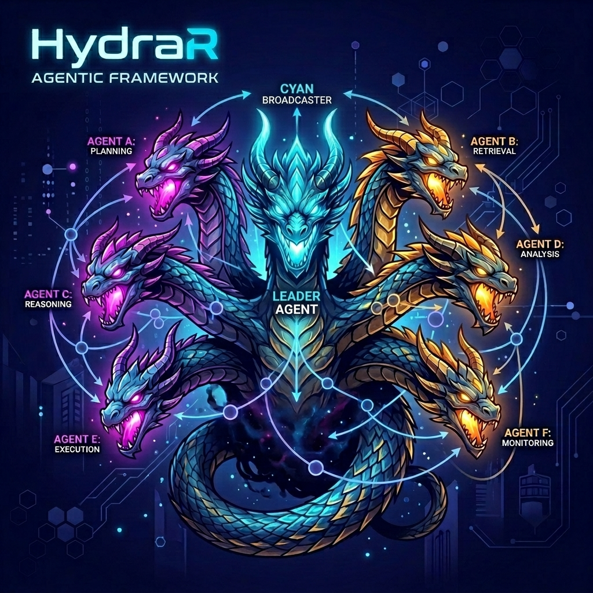

# HydraR: Stateful Agentic Orchestration for R

[](https://lifecycle.r-lib.org/articles/stages.html#stable)
[](https://github.com/apaf-bioinformatics/HydraR/actions/workflows/R-CMD-check.yaml)
[](https://app.codecov.io/gh/apaf-bioinformatics/HydraR)

`HydraR` is a lightweight, state-of-the-art orchestrator for building general-purpose agentic workflows in R. It prioritizes **CLI-native LLM interactions**, **hardened state management**, and **graph-based execution** (supporting both Directed Acyclic Graphs and iterative loops).

## Why HydraR?

Standard agentic frameworks often rely heavily on brittle API wrappers and volatile state. `HydraR` is built for durability and reproducibility:
- **CLI-First**: Directly drive high-performance CLI tools like `gemini-cli`, `claude-code`, or `gh copilot`.
- **Hardened State**: Implements a robust state machine with persistent checkpointing (DuckDB/SQLite).
- **Graph-Native**: Design complex logic transitions and loops with built-in validation.

## 🌐 Ecosystem & Similar Packages

`HydraR` is an **orchestrator**, not a low-level API wrapper. While many excellent packages focus on the communication layer, `HydraR` focuses on the **lifecycle, state, and file-system isolation** of multi-agent workflows.

- **[ellmer](https://github.com/tidyverse/ellmer)**: Focuses on high-level UI/API interaction with LLMs. `HydraR` can use `ellmer` (or direct CLI calls) as a backend driver within a larger managed graph.
- **[mall](https://github.com/simonpcouch/mall)**: Provides a concise syntax for data-mapping LLM calls. `HydraR` is designed for more complex, stateful research pipelines with cyclic dependencies.
- **[gptstudio](https://github.com/MichelNivard/gptstudio)**: Tooling for IDE-centric coding assistance. `HydraR` is built for reproducible, non-interactive pipelines and automation.
- **[reticulate](https://rstudio.github.io/reticulate/)**: While `HydraR` is R-native, it leverages `reticulate` to drive Python-based agentic tools (like `gemini-cli`) while maintaining the orchestration state in R.

## Key Features

- **📍 Graph Orchestration**: Define complex agentic workflows using `AgentDAG` with support for parallel execution (`furrr`) and conditional loops.
- **💾 Centralized State**: `AgentState` provides a single source of truth for all nodes, with support for complex reducers and history management.
- **🕒 Persistent Checkpointing**: Resumable execution threads via `Checkpointer` (supporting SQLite/DuckDB).
- **🖥️ CLI-First Drivers**: High-fidelity drivers for local and provider-based CLIs, ensuring tool calls and environment discovery are robust.
- **📊 Mermaid Visualization**: Export your agent's logic directly to Mermaid.js syntax for interactive documentation.
- **🛡️ Validation Engine**: Integrated compile-time checks for undefined nodes, circular dependencies, and unreachable states.
- **🏷️ Node Labeling**: Support for human-readable labels in DAG nodes, independent of their unique IDs.

## Installation

You can install the development version from GitHub:

```r
# install.packages("devtools")
devtools::install_github("apaf-bioinformatics/HydraR")
```

## 📖 Documentation & Manual

The primary resource for learning `HydraR` is the **[Complete Instruction Manual](vignettes/manual.Rmd)**. 

### Case Studies & Examples

- **📍 [Sydney to Hong Kong Travel Planner](vignettes/hong_kong_travel.Rmd)**: High-fidelity orchestration using the `GeminiCLIDriver` to book a complex itinerary.
- **💾 [Academic Research Assistant](vignettes/academic_research.Rmd)**: Demonstrates literature search and stateful summarization.
- **🛡️ [Software Bug Assistant](vignettes/software_bug_assistant.Rmd)**: Shows how to orchestrate code analysis and fix suggestions.
- **🛠️ [Creating Custom Drivers](vignettes/creating_drivers.Rmd)**: Developer guide on subclassing `AgentDriver` with Mocking and API support.
- **🛡️ [Isolated Execution with Git Worktrees](vignettes/git_worktree_toy.Rmd)**: A toy program demonstrating safe, parallel file modifications using the Gemini CLI.

### 🛠️ Technical Documentation

For deep technical dives into the orchestration engine and developer tools, refer to the following manuals:

- **[HydraR Orchestration Manual](https://github.com/apaf-bioinformatics/HydraR/blob/main/notes/HydraR_Orchestration_Manual.md)**: YAML anatomy, role definitions, and MCP support.
- **[HydraR Validation Reference](https://github.com/apaf-bioinformatics/HydraR/blob/main/notes/HydraR_Validation_Reference.md)**: Full list of compile-time and runtime safety checks.
- **[Mermaid Orchestration Cheatsheet](https://github.com/apaf-bioinformatics/HydraR/blob/main/notes/mermaid_orchestration_cheatsheet.md)**: Reserved keywords and visual syntax for agent networks.
- **[Useful Tools Manual](https://github.com/apaf-bioinformatics/HydraR/blob/main/notes/useful_tools_manual.md)**: Diagnostic scripts for DuckDB state inspection and monitoring.
- **[Integrating HydraR with `targets`](https://github.com/apaf-bioinformatics/HydraR/blob/main/notes/how_to_integrate_with_target.md)**: Best practices for cached, interrupt-safe agentic pipelines.

## 🤖 Use of Generative AI

- [x] **Generative AI tools were used to produce material in this submission.** 
- **AI-Aided Development**: Large Language Models were used to implement specific logic blocks, boilerplate code, and unit tests. Every line of AI-generated code has been manually reviewed and verified by the authors.
- **Agentic Orchestration**: This package is explicitly designed for the orchestration of autonomous AI agents.
- For a detailed disclosure of AI usage, please refer to the **[agents.md](agents.md)** file.
- For architectural rationale and design tradeoffs, please refer to the **[DESIGN.md](DESIGN.md)** file.

## Custom Drivers

`HydraR` is provider-agnostic. You can extend the framework by creating custom R6 classes that inherit from `AgentDriver`. This allows you to drive:
- **Local LLMs**: Integration with specialized local CLI wrappers.
- **Enterprise APIs**: Secure connection to internal LLM endpoints via `httr2`.
- **Mock Backends**: Deterministic drivers for unit testing complex DAG logic.

Refer to the [Creating Custom Drivers](vignettes/creating_drivers.Rmd) guide for implementation details.

## 📊 Visualizing Execution

`HydraR` includes a powerful visualization engine that goes beyond static DAGs. You can generate status-colored plots after a run to identify bottlenecks and failures.

### Interactive Rendering in R

We recommend using the [`DiagrammeR`](https://dgritree.github.io/DiagrammeR/) package to render your DAGs directly in the RStudio Viewer:

```r
library(HydraR)
library(DiagrammeR)

# Generate a status-colored plot after a run
# Green = Success, Red = Failure, Blue = Active path
DiagrammeR::mermaid(dag$plot(status = TRUE))
```

### Path Highlighting

The `plot(status = TRUE)` method automatically correlates your execution `trace_log` with the graph structure to highlight the **exact path** taken by the agents, including loops and branches.

### Mermaid Round-Trip

You can also define your agentic workflows using pure Mermaid syntax and convert them directly into R objects:

```r
mermaid <- "graph TD\n  Start --> End"
dag <- mermaid_to_dag(mermaid, my_node_factory)
```

## "Hello World" Example

```r
library(HydraR)

# 1. Define a simple logic node
node_hello <- AgentLogicNode$new(
    id = "hello_world",
    logic_fn = function(state) {
        input_text <- state$get("input")
        list(status = "SUCCESS", output = list(message = paste("Hello", input_text)))
    }
)

# 2. Build the orchestrator
dag <- AgentDAG$new()
dag$add_node(node_hello)
dag$compile()

# 3. Execute
results <- dag$run(initial_state = list(input = "Hydra"))
print(results$results$hello_world$output$message)
# [1] "Hello Hydra"

# 4. Round-Trip Visualization
dag$plot(type = "mermaid")
# Outputs Mermaid syntax using node labels if provided
```

## APAF Standards

This project adheres to the **APAF Bioinformatics** standards for agentic reproducibility and software hardness. All development followed a "Human-in-the-loop" pattern for AI-assisted contributions.

---
<!-- APAF Bioinformatics | HydraR | Approved | 2026-03-31 -->
