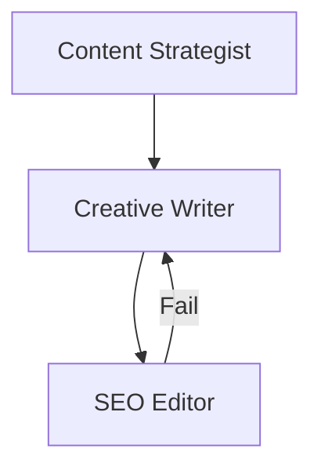

# Agentic Blog Writer

## Introduction

This vignette demonstrates the **Blog Writer** pattern using `HydraR`.

Content creation often involves a multi-stage pipeline consisting of
brainstorming, drafting, and reviewing. We model this as a DAG with a
mix of linear execution and cyclic feedback using the **Gemini CLI**.

1.  **Outliner Node**: Generates a structured outline based on a topic.
2.  **Drafter Node**: Takes the outline and writes the draft. It also
    reacts to feedback from the Editor.
3.  **Editor Node**: Reviews the draft for SEO and readability. If it
    fails the checks, it loops back to the Drafter.

## Setup

``` r
library(HydraR)

# Initialize the Gemini CLI driver
driver <- GeminiCLIDriver$new()
```

## Building the DAG

Initialize the `AgentDAG`.

``` r
dag <- AgentDAG$new()
```

### 1. The Outliner Node

Generates the core structure of the blog post.

``` r
outliner_node <- AgentLLMNode$new(
  id = "Outliner",
  label = "Content Strategist",
  role = "You are a content strategist. Create a structured outline for a blog post based on a topic provided by the user.",
  driver = driver,
  prompt_builder = function(state) {
    sprintf("Topic: %s\nProvide a detailed multisection outline.", state$get("blog_topic"))
  }
)

dag$add_node(outliner_node)
```

### 2. The Drafter Node

Merges the outline with any editor feedback.

``` r
drafter_node <- AgentLLMNode$new(
  id = "Drafter",
  label = "Creative Writer",
  role = "You are a professional blog writer. Draft a full blog post based on an outline and any specific editorial feedback.",
  driver = driver,
  prompt_builder = function(state) {
    feedback_text <- if (!is.null(state$get("Editor"))) sprintf("\nFeedback: %s", state$get("Editor")) else ""
    sprintf("Outline: %s%s\nDraft the full blog post.", state$get("Outliner"), feedback_text)
  }
)

dag$add_node(drafter_node)
```

### 3. The Editor Node

Reviews the draft for SEO and quality.

``` r
editor_node <- AgentLLMNode$new(
  id = "Editor",
  label = "SEO Editor",
  role = "You are an SEO specialist. Review the blog draft. If it is excellent, say 'Approved'. If not, provide specific 'Improvement Feedback'.",
  driver = driver,
  prompt_builder = function(state) {
    sprintf("Draft: %s\nDoes this meet professional standards? Respond either with 'Approved' or detailed feedback.", state$get("Drafter"))
  }
)

dag$add_node(editor_node)
```

## Defining Transitions

Combine linear and cyclic edges.

``` r
dag$set_start_node("Outliner")

dag$add_edge("Outliner", "Drafter")
dag$add_edge("Drafter", "Editor")

dag$add_conditional_edge(
  from = "Editor",
  test = function(out) {
    grepl("Approved", out, ignore.case = TRUE)
  },
  if_true = NULL, # Stop!
  if_false = "Drafter" # Back to drafter
)

compiled_dag <- dag$compile()
#> Warning in dag$compile(): Potential infinite loop detected: graph contains
#> cycles. Ensure conditional edges have exit conditions.
#> Graph compiled successfully.
```

## Visualizing the Workflow

``` r
cat("```mermaid\n")
```

``` mermaid
``` r
cat(compiled_dag$plot(type = "mermaid"))
```




``` r
cat("\n```\n")
```

    ## Running the Scenario


    ``` r
    initial_state <- list(
      blog_topic = "Agentic Workflows in R"
    )

    cat("Starting Blog Creation Engine...\n")
    result <- compiled_dag$run(initial_state = initial_state, max_steps = 10)

    cat("\n--- BLOG PUBLICATION STATUS ---\n")
    cat("Final Output:\n", result$state$get("Drafter"), "\n")
    cat("Editor Decision:", result$state$get("Editor"), "\n")

The DAG easily handles complex flows involving both straight-through
processing and localized feedback loops.
