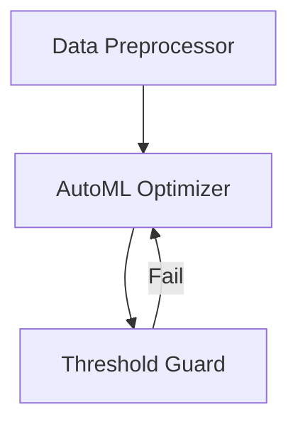

# Agentic Data Science Assistant

## Introduction

This vignette demonstrates the **Data Science Assistant** pattern using
`HydraR`.

In machine learning workflows, hyperparameter tuning is an inherently
iterative process. We can map this paradigm to an `AgentDAG` using the
**Gemini CLI**.

The workflow contains an initial data setup phase followed by a cyclic
model optimization phase: 1. **Data Cleaner Node**: Ingests and prepares
the raw data for analysis. 2. **Model Trainer Node**: Uses an LLM to
recommend hyperparameters and simulate model training. 3. **Evaluator
Node**: Assesses the model’s accuracy. If it falls below a target
threshold, it generates specific refinement feedback and loops back for
re-optimization.

## Setup

``` r
library(HydraR)

# Initialize the Gemini CLI driver
driver <- GeminiCLIDriver$new()
```

## Building the DAG

Initialize the `AgentDAG`.

``` r
dag <- AgentDAG$new()
```

### 1. The Data Cleaner Node

Prepares the data exactly once. This node uses a standard R function for
deterministic data processing.

``` r
cleaner_node <- AgentLogicNode$new(
  id = "DataCleaner",
  label = "Data Preprocessor",
  logic_fn = function(state, memory = NULL) {
    dataset <- state$get("raw_data")
    # Mock cleaning logic
    clean_data <- paste("Cleaned", dataset)
    list(status = "SUCCESS", output = list(clean_data = clean_data))
  }
)

dag$add_node(cleaner_node)
```

### 2. The Model Trainer Node

Trains the model iteratively using LLM-driven parameter recommendations.

``` r
trainer_node <- AgentLLMNode$new(
  id = "ModelTrainer",
  label = "AutoML Optimizer",
  role = "You are an AutoML expert. Given a dataset and previous accuracy logs, recommend a new set of hyperparameters.",
  driver = driver,
  prompt_builder = function(state) {
    feedback_text <- if (!is.null(state$get("Evaluator"))) sprintf("\nFeedback: %s", state$get("Evaluator")) else ""
    sprintf("Dataset: %s%s\nOutput exactly a model configuration string.", state$get("clean_data"), feedback_text)
  }
)

dag$add_node(trainer_node)
```

### 3. The Evaluator Node

This node uses logic to evaluate the result against a hard constraint.

``` r
evaluator_node <- AgentLogicNode$new(
  id = "Evaluator",
  label = "Threshold Guard",
  logic_fn = function(state, memory = NULL) {
    # Extract training configuration from the previous LLM node
    config <- state$get("ModelTrainer")
    target <- state$get("target_accuracy")

    # Mock evaluation logic: Simulated improvement per iteration
    iteration <- state$get("total_evaluations")
    if (is.null(iteration)) iteration <- 0
    iteration <- iteration + 1

    accuracy <- min(0.60 + (iteration * 0.10), 0.95)

    if (accuracy >= target) {
      list(status = "SUCCESS", output = list(
        optimization_complete = TRUE,
        eval_message = sprintf("Target reached: %.2f >= %.2f using config: %s", accuracy, target, config),
        total_evaluations = iteration
      ))
    } else {
      list(status = "SUCCESS", output = list(
        optimization_complete = FALSE,
        eval_message = sprintf("Accuracy %.2f is below %.2f. Recommending new parameters.", accuracy, target),
        total_evaluations = iteration
      ))
    }
  }
)

dag$add_node(evaluator_node)
```

## Defining Transitions

Configure the linear start and the cyclic optimization loop.

``` r
dag$set_start_node("DataCleaner")

dag$add_edge("DataCleaner", "ModelTrainer")
dag$add_edge("ModelTrainer", "Evaluator")

dag$add_conditional_edge(
  from = "Evaluator",
  test = function(out) {
    isTRUE(out$optimization_complete)
  },
  if_true = NULL, # Done!
  if_false = "ModelTrainer"
)

compiled_dag <- dag$compile()
#> Warning in dag$compile(): Potential infinite loop detected: graph contains
#> cycles. Ensure conditional edges have exit conditions.
#> Graph compiled successfully.
```

## Visualizing the Workflow

``` r
cat("```mermaid\n")
```

``` mermaid
``` r
cat(compiled_dag$plot(type = "mermaid"))
```




``` r
cat("\n```\n")
```

    ## Running the Scenario


    ``` r
    initial_state <- list(
      raw_data = "Titanic_Dataset.csv",
      target_accuracy = 0.85
    )

    cat("Starting AutoML Pipeline...\n")
    result <- compiled_dag$run(initial_state = initial_state, max_steps = 10)

    cat("\n--- TRAINING PIPELINE COMPLETE ---\n")
    cat("Final Training Config:", result$state$get("ModelTrainer"), "\n")
    cat("Final Accuracy Status:", result$state$get("eval_message"), "\n")

The DAG seamlessly executed the data prep before dropping into an
iterative optimization loop until the target metric was satisfied!
