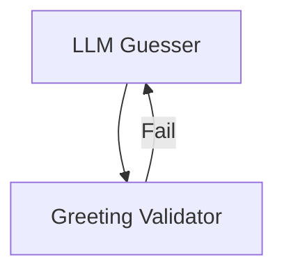

# Hello World: Building an Agentic Loop with HydraR

## Introduction

This vignette demonstrates how to construct a simple “Hello World”
agentic loop using the `HydraR` framework and the **Gemini CLI**.

In this example, we will create a Directed Acyclic Graph (DAG) with two
nodes: 1. An **Executor** node (using the Gemini LLM). 2. A
**Validator** node ensuring the Executor achieved its goal.

## 1. Setup

First, load the library and the Gemini CLI driver.

``` r
library(HydraR)

# Initialize the Gemini CLI driver
driver <- GeminiCLIDriver$new()
```

## 2. Initialize the DAG

We initialize an `AgentDAG` which will orchestrate our nodes.

``` r
dag <- AgentDAG$new()
```

## 3. Define Nodes

We use `AgentLLMNode` for the reasoning part and `AgentLogicNode` for
the deterministic check part.

``` r
# LLM Guesser Node
executor_node <- AgentLLMNode$new(
  id = "Guesser",
  label = "LLM Guesser",
  role = "You are an agent trying to guess a specific word. Your task is to output exactly one word in lowercase.",
  driver = driver,
  prompt_builder = function(state) {
    "Guess the secret greeting word."
  }
)

# Deterministic Validator Node
validator_node <- AgentLogicNode$new(
  id = "Validator",
  label = "Greeting Validator",
  logic_fn = function(state, memory = NULL) {
    guess <- tolower(trimws(state$get("Guesser")))
    is_valid <- (guess == "hello")
    list(status = "SUCCESS", output = list(valid = is_valid))
  }
)

dag$add_node(executor_node)
dag$add_node(validator_node)
dag$set_start_node("Guesser")
```

## 4. Define Transitions

We create a conditional transition to loop back if the guess is
incorrect.

``` r
# Unconditional edge from Guesser to Validator
dag$add_edge("Guesser", "Validator")

# Conditional edge: if not valid, loop back to Guesser
dag$add_conditional_edge("Validator",
  test = function(out) isTRUE(out$valid),
  if_true = NULL, # Stop execution on success
  if_false = "Guesser" # Loop back if not valid
)
```

## 5. Visualizing the Workflow

``` r
cat("```mermaid\n")
```

``` mermaid
``` r
cat(dag$compile()$plot(type = "mermaid"))
#> Warning in dag$compile(): Potential infinite loop detected: graph contains
#> cycles. Ensure conditional edges have exit conditions.
```

Graph compiled successfully.




``` r
cat("\n```\n")
```

    ## 6. Execution

    Run the DAG!


    ``` r
    compiled_dag <- dag$compile()
    final_state <- compiled_dag$run(initial_state = list(), max_steps = 10)

    # View final results
    cat("Final Guess:", final_state$state$get("Guesser"), "\n")
    cat("Success Status:", final_state$state$get("valid"), "\n")

The system successfully loops until the LLM produces the correct target
greeting!
