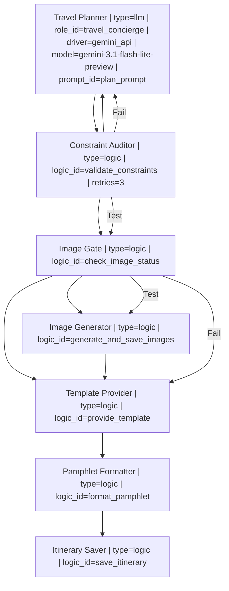

# Agentic Travel Planning: Sydney to Hong Kong

``` r
# Toggle for slow/expensive and potentially rate-limited AI figure generation
# Set to TRUE to force-regenerate the images, otherwise uses existing ones.
FORCE_REGENERATE_IMAGES <- FALSE
ASPECT_RATIO <- "16:9"


## If you want to regenerate the images, you'll need to turn FORCE_REGENERATE_IMAGES to TRUE
## and also set the GEMINI_API_KEY environment variable in .Renviron file.
```

## Introduction

This vignette demonstrates the **Zero-R-Code** orchestration pattern
using `HydraR`. Instead of defining roles, logic, and state in R blocks,
we define the entire workflow in a single `workflow.yml` file.

The R environment acts purely as an **interpreter/compiler** for the
language-independent manifest.

## Setup

First, load the HydraR library.

``` r
library(HydraR)
```

## Loading the Workflow (Declarative YAML)

We use
[`load_workflow()`](https://APAF-bioinformatics.github.io/HydraR/reference/load_workflow.md)
to ingest the entire definition from `hong_kong_travel.yml`. This file
contains the: 1. **Mermaid Graph** (Source of truth for DAG
architecture) 2. **LLM Roles** (System prompts for travel concierges) 3.
**Anonymous Logic** (R snippets for constraints and prompting) 4.
**Initial State** (Pre-configurations for the journey)

``` r
# Load everything from the external declarative source
wf <- load_workflow("hong_kong_travel.yml")
```

## Instantiating the DAG

With the registries populated by the loader, we simply pass the graph
and the universal
[`auto_node_factory()`](https://APAF-bioinformatics.github.io/HydraR/reference/auto_node_factory.md)
to
[`mermaid_to_dag()`](https://APAF-bioinformatics.github.io/HydraR/reference/mermaid_to_dag.md).

``` r
dag <- spawn_dag(wf, auto_node_factory())
#> [HydraR Warning] Logic 'plan_prompt': 'state' object is not referenced. Ensure your logic interacts with the AgentState.
#> [HydraR Warning] Logic 'plan_prompt' [Lint]: Put spaces around all infix operators. (line 1)
#> [HydraR Warning] Logic 'image_prompt': 'state' object is not referenced. Ensure your logic interacts with the AgentState.
#> [HydraR Warning] Logic 'image_prompt' [Lint]: Put spaces around all infix operators. (line 1)
#> [HydraR Warning] Logic 'validate_constraints': 'state' object is not referenced. Ensure your logic interacts with the AgentState.
#> [HydraR Warning] Logic 'validate_constraints' [Lint]: Put spaces around all infix operators. (line 1)
#> [HydraR Warning] Logic 'check_image_status': 'state' object is not referenced. Ensure your logic interacts with the AgentState.
#> [HydraR Warning] Logic 'check_image_status' [Lint]: Put spaces around all infix operators. (line 1)
#> [HydraR Warning] Logic 'generate_and_save_images': 'state' object is not referenced. Ensure your logic interacts with the AgentState.
#> [HydraR Warning] Logic 'generate_and_save_images' [Lint]: Put spaces around all infix operators. (line 1)
#> [HydraR Warning] Logic 'provide_template': 'state' object is not referenced. Ensure your logic interacts with the AgentState.
#> [HydraR Warning] Logic 'provide_template' [Lint]: Put spaces around all infix operators. (line 1)
#> [HydraR Warning] Logic 'format_pamphlet': 'state' object is not referenced. Ensure your logic interacts with the AgentState.
#> [HydraR Warning] Logic 'format_pamphlet' [Lint]: Put spaces around all infix operators. (line 1)
#> [HydraR Warning] Logic 'save_itinerary': 'state' object is not referenced. Ensure your logic interacts with the AgentState.
#> [HydraR Warning] Logic 'save_itinerary' [Lint]: Put spaces around all infix operators. (line 1)
#> Warning in dag$compile(): Potential infinite loop detected: graph contains
#> cycles. Ensure conditional edges have exit conditions.
#> Graph compiled successfully.
```

## Visualizing the Workflow

We can view the agent’s logic directly using Mermaid.js syntax.

``` r
cat("```mermaid\n")
```

``` mermaid
``` r
cat(dag$plot(type = "mermaid", details = TRUE))
```




``` r
cat("\n```\n")
```

    ## Execution

    When we run the DAG, we use the `initial_state` extracted from the YAML file. No manual R list creation is required.


    ``` r
    # Register a checkpointer for durability
    checkpointer <- DuckDBSaver$new(db_path = "travel_booking.duckdb")

    # Run the orchestration using the state from YAML
    results <- dag$run(
      initial_state = append(wf$initial_state, list(
        force_regenerate_images = FORCE_REGENERATE_IMAGES,
        aspect_ratio = ASPECT_RATIO
      )),
      max_steps = 15,
      checkpointer = checkpointer
    )
    #> Warning in self$compile(): Potential infinite loop detected: graph contains
    #> cycles. Ensure conditional edges have exit conditions.
    #> Graph compiled successfully.
    #> [2026-04-05 10:14:19] [DEBUG] Queue: Planner | Running: Planner
    #> DEBUG: [gemini_api] Calling URL: https://generativelanguage.googleapis.com/v1beta/models/gemini-3.1-flash-lite-preview:generateContent
    #> [2026-04-05 10:14:27] [DEBUG] Queue: Validator | Running: Validator
    #>    [Validator] Executing R logic...
    #> [2026-04-05 10:14:27] [DEBUG] Queue: Planner | Running: Planner
    #> DEBUG: [gemini_api] Calling URL: https://generativelanguage.googleapis.com/v1beta/models/gemini-3.1-flash-lite-preview:generateContent
    #> [2026-04-05 10:14:35] [DEBUG] Queue: Validator | Running: Validator
    #>    [Validator] Executing R logic...
    #> [2026-04-05 10:14:35] [DEBUG] Queue: Planner | Running: Planner
    #> DEBUG: [gemini_api] Calling URL: https://generativelanguage.googleapis.com/v1beta/models/gemini-3.1-flash-lite-preview:generateContent
    #> [2026-04-05 10:14:43] [DEBUG] Queue: Validator | Running: Validator
    #>    [Validator] Executing R logic...
    #> [2026-04-05 10:14:43] [DEBUG] Queue: Planner | Running: Planner
    #> DEBUG: [gemini_api] Calling URL: https://generativelanguage.googleapis.com/v1beta/models/gemini-3.1-flash-lite-preview:generateContent
    #> [2026-04-05 10:14:51] [DEBUG] Queue: Validator | Running: Validator
    #>    [Validator] Executing R logic...
    #> [2026-04-05 10:14:51] [DEBUG] Queue: Planner | Running: Planner
    #> DEBUG: [gemini_api] Calling URL: https://generativelanguage.googleapis.com/v1beta/models/gemini-3.1-flash-lite-preview:generateContent
    #> [2026-04-05 10:14:59] [DEBUG] Queue: Validator | Running: Validator
    #>    [Validator] Executing R logic...
    #> [2026-04-05 10:14:59] [DEBUG] Queue: Planner | Running: Planner
    #> DEBUG: [gemini_api] Calling URL: https://generativelanguage.googleapis.com/v1beta/models/gemini-3.1-flash-lite-preview:generateContent
    #> [2026-04-05 10:15:08] [DEBUG] Queue: Validator | Running: Validator
    #>    [Validator] Executing R logic...
    #> [2026-04-05 10:15:08] [DEBUG] Queue: Planner | Running: Planner
    #> DEBUG: [gemini_api] Calling URL: https://generativelanguage.googleapis.com/v1beta/models/gemini-3.1-flash-lite-preview:generateContent
    #> [2026-04-05 10:15:16] [DEBUG] Queue: Validator | Running: Validator
    #>    [Validator] Executing R logic...
    #> [2026-04-05 10:15:16] [DEBUG] Queue: Planner | Running: Planner
    #> DEBUG: [gemini_api] Calling URL: https://generativelanguage.googleapis.com/v1beta/models/gemini-3.1-flash-lite-preview:generateContent
    #> Warning in self$.run_iterative(max_steps, checkpointer, thread_id, resume_from,
    #> : Reached max_steps.

    # Display final itinerary
    cat("\n\n### Generated Itinerary\n")
    #> 
    #> 
    #> ### Generated Itinerary
    cat(as.character(results$state$get("Planner")))
    #> Hello! As your travel concierge, I am delighted to curate your 2026 itinerary for your upcoming trip to Hong Kong. Traveling via Qantas from Sydney, you will arrive refreshed and ready to experience the blend of colonial history, vibrant street culture, and island charm.
    #> 
    #> ### **Flight Logistics (Proposed)**
    #> *   **Departure:** May 26, 2026 – Qantas SYD to HKG (Overnight flight)
    #> *   **Arrival:** May 27, 2026 – Morning arrival at Hong Kong International Airport (HKG)
    #> 
    #> ---
    #> 
    #> ### **Day 1: May 27 – Arrival & The Harbour Views**
    #> *   **Morning:** Arrive in HKG. Take the Airport Express to Hong Kong Station. Check into your hotel (Central or Admiralty area recommended).
    #> *   **Afternoon:** Acclimatize with a stroll through **Hong Kong Park** to see the aviary. Head to the **Peak Tram** for iconic views of the skyline.
    #> *   **Evening:** Enjoy dinner at **The Spaghetti House** (Peak Galleria branch). It’s a local classic that offers comfort food with one of the most stunning views in the world.
    #> *   **Night:** Walk the **Tsim Sha Tsui Promenade** to watch the "A Symphony of Lights" show at 8:00 PM.
    #> 
    #> ### **Day 2: May 28 – The Island Charm of Cheung Chau**
    #> *   **Morning:** Take the MTR to Central Pier #5. Catch the **ferry to Cheung Chau Island** (approx. 35–55 mins).
    #> *   **Daytime:** Explore the narrow lanes of this car-free island. Visit the **Pak Tai Temple** and the **Mini Great Wall** hiking trail for coastal scenery.
    #> *   **Lunch:** Dine at a local seafood restaurant along **Praya Street**. Order steamed scallops with vermicelli and garlic—a staple of Cheung Chau.
    #> *   **Afternoon:** Grab a famous **"Mango Mochi"** from a street vendor and relax at **Tung Wan Beach**.
    #> *   **Evening:** Return to Central. For dinner, try authentic **Cantonese Dim Sum** at *Maxim’s Palace* (City Hall) for an elegant, traditional trolley service experience.
    #> 
    #> ### **Day 3: May 29 – Heritage & Market Culture**
    #> *   **Morning:** Head to **Sheung Wan**. Visit the **Man Mo Temple** and wander through the antique shops on Hollywood Road.
    #> *   **Lunch:** Visit a *Cha Chaan Teng* (Hong Kong-style tea house). Try **Lan Fong Yuen** for their famous "pantyhose" milk tea and pork chop buns.
    #> *   **Afternoon:** Take the bus or taxi to **Sham Shui Po**. This is the heart of local, gritty, authentic Hong Kong. Explore the **Apliu Street Electronics Market** and the fabric markets.
    #> *   **Dinner:** Eat like a local in Sham Shui Po. Visit **Tim Ho Wan** (the original hole-in-the-wall location) for world-class, affordable Michelin-starred dim sum.
    #> 
    #> ### **Day 4: May 30 – Lantau Island & Giant Buddha**
    #> *   **Morning:** Take the MTR to Tung Chung and ride the **Ngong Ping 360 Cable Car** (crystal cabin recommended) for incredible views.
    #> *   **Daytime:** Visit the **Tian Tan Buddha (Big Buddha)** and the **Po Lin Monastery**.
    #> *   **Lunch:** Enjoy a vegetarian meal inside the Po Lin Monastery.
    #> *   **Afternoon:** Take a bus to **Tai O Fishing Village**. See the traditional stilt houses and take a small boat ride to potentially spot pink dolphins.
    #> *   **Evening:** Return to the city. Have dinner at **Mak’s Noodle** in Central for their signature Wonton Noodle Soup.
    #> 
    #> ### **Day 5: May 31 – Kowloon Exploration & Last Bites**
    #> *   **Morning:** Visit the **West Kowloon Cultural District**. Walk through the **M+ Museum** or the **Hong Kong Palace Museum**.
    #> *   **Lunch:** Visit a local **Roast Goose** restaurant (such as *Kam's Roast Goose* in Wan Chai). It is a local culinary icon.
    #> *   **Afternoon:** Shop for souvenirs at the **Temple Street Night Market** (opens late afternoon). 
    #> *   **Evening:** Final celebration dinner at **The Spaghetti House** (Causeway Bay branch) to enjoy their extensive menu once more, or explore a high-end Cantonese restaurant like *Lung King Heen* for a splurge.
    #> 
    #> ### **Day 6: June 1 – Departure**
    #> *   **Morning:** Enjoy a slow morning with a traditional Hong Kong breakfast—Pineapple bun with a thick slice of butter and hot milk tea.
    #> *   **Afternoon:** Take the Airport Express back to HKG for your return Qantas flight to Sydney.
    #> 
    #> ---
    #> 
    #> ### **Concierge Tips for Your Trip:**
    #> 1.  **Octopus Card:** This is essential. Buy one at the airport; it covers all MTR, ferries (including Cheung Chau), buses, and even convenience stores.
    #> 2.  **Footwear:** You will be doing a lot of walking, especially on Cheung Chau and in the markets. Bring your most comfortable sneakers.
    #> 3.  **Dining:** Most local restaurants operate on a "share table" basis during busy hours—don't be surprised if you are seated next to locals!
    #> 4.  **Weather:** May/June is the start of the humidity and monsoon season. Carry a lightweight travel umbrella or a high-quality raincoat.
    #> 
    #> **Safe travels! Please let me know if you would like me to adjust any of these reservations or activities.**

    # Display Constraint Audit Report
    cat("\n\n### Constraint Audit Report\n")
    #> 
    #> 
    #> ### Constraint Audit Report
    report <- results$state$get("report")
    if (!is.null(report)) {
      cat(as.character(report))
    } else {
      cat("No audit report available.")
    }
    #> ### Constraint Audit Report
    #> Date: 2026-04-05 10:15:16.033293
    #> - [x] Cheung Chau Island
    #> - [x] Spaghetti House
    #> - [x] Local Cuisine

    # Display Pamphlet (HTML)
    cat("\n\n### Formatted Pamphlet (HTML Fragment)\n")
    #> 
    #> 
    #> ### Formatted Pamphlet (HTML Fragment)
    pamphlet_html <- results$state$get("PamphletFormatter")
    if (!is.null(pamphlet_html)) {
      htmltools::HTML(pamphlet_html)
    } else {
      cat("Pamphlet not generated.")
    }
    #> Pamphlet not generated.

    # List Artifacts
    cat("\n\n### Generated Artifacts\n")
    #> 
    #> 
    #> ### Generated Artifacts
    artifacts <- list.files(pattern = "hong_kong|validation_report")
    if (length(artifacts) > 0) {
      cat(paste("- ", artifacts, collapse = "\n"))
    } else {
      cat("No artifacts found.")
    }
    #> -  hong_kong_pamphlet.html
    #> -  hong_kong_travel.Rmd
    #> -  hong_kong_travel.Rmd.orig
    #> -  hong_kong_travel.yml

## Conclusion

This workflow demonstrates how `HydraR` enables **Truly Zero-R-Code**
definitions: 1. **Language-Independent**: The workflow is defined in
YAML and Mermaid, making it portable. 2. **Reduced Boilerplate**:
[`load_workflow()`](https://APAF-bioinformatics.github.io/HydraR/reference/load_workflow.md)
handles all registration and state parsing. 3. **Maintainable**: Logic
and roles are separated from the R execution engine.

------------------------------------------------------------------------
