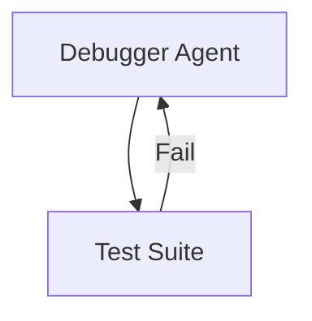

# Agentic Software Bug Assistant

## Introduction

This vignette demonstrates the **Software Bug Assistant** pattern using
`HydraR` and the **Gemini CLI**.

In this scenario, two agent nodes work together to resolve a software
bug: 1. **Bug Analyzer Node**: Reviews the error message and current
code, then proposes a patch. 2. **Test Runner Node**: Simulates running
a test suite against the proposed patch. If the test fails, it provides
error traces back to the Bug Analyzer.

This is a classic “Generate-and-Test” self-healing loop.

## Setup

``` r
library(HydraR)

# Initialize the Gemini CLI driver
driver <- GeminiCLIDriver$new()
```

## Building the DAG

Initialize the `AgentDAG`.

``` r
dag <- AgentDAG$new()
```

### 1. The Bug Analyzer Node

This node uses an LLM to digest a bug report and iterative test failures
to eventually produce a working patch.

``` r
analyzer_node <- AgentLLMNode$new(
  id = "Analyzer",
  label = "Debugger Agent",
  role = "You are a software engineer specializing in fixing R bugs. Review the bug report and any previous test failures, then provide a corrected R code snippet.",
  driver = driver,
  prompt_builder = function(state) {
    feedback_text <- if (!is.null(state$get("Tester"))) sprintf("\nTest Feedback: %s", state$get("Tester")) else ""
    sprintf("Bug Report: %s%s\nOutput exactly a snippet of R code.", state$get("bug_report"), feedback_text)
  }
)

dag$add_node(analyzer_node)
```

### 2. The Test Runner Node

This node evaluates the patch using deterministic logic (mocked here).

``` r
tester_node <- AgentLogicNode$new(
  id = "Tester",
  label = "Test Suite",
  logic_fn = function(state, memory = NULL) {
    patch <- state$get("Analyzer")

    # Mock evaluation logic: In our scenario, the fix must use is.null().
    if (grepl("is.null", patch, fixed = TRUE)) {
      list(status = "SUCCESS", output = list(
        tests_passed = TRUE,
        test_feedback = "All 5 tests passed successfully."
      ))
    } else {
      list(status = "SUCCESS", output = list(
        tests_passed = FALSE,
        test_feedback = "Error: object 'NULL' not found. Did you mean to use 'is.null()'?"
      ))
    }
  }
)

dag$add_node(tester_node)
```

## Defining Transitions

We structure the loop. `Tester` conditionally loops back to `Analyzer`
upon test failure.

``` r
dag$set_start_node("Analyzer")

dag$add_edge("Analyzer", "Tester")

dag$add_conditional_edge(
  from = "Tester",
  test = function(out) {
    isTRUE(out$tests_passed)
  },
  if_true = NULL, # End execution
  if_false = "Analyzer" # Retry
)

compiled_dag <- dag$compile()
#> Warning in dag$compile(): Potential infinite loop detected: graph contains
#> cycles. Ensure conditional edges have exit conditions.
#> Graph compiled successfully.
```

## Visualizing the Workflow

``` r
cat("```mermaid\n")
```

``` mermaid
``` r
cat(compiled_dag$plot(type = "mermaid"))
```




``` r
cat("\n```\n")
```

    ## Running the Scenario

    Provide the initial bug report and start the DAG.


    ``` r
    initial_state <- list(
      bug_report = "Function crashes when 'x' is missing."
    )

    cat("Starting Automatic Bug Remediation...\n")
    result <- compiled_dag$run(initial_state = initial_state, max_steps = 10)

    cat("\n--- RESOLUTION RESULT ---\n")
    cat("Final Patch Proposed:", result$state$get("Analyzer"), "\n")
    cat("Test Results:", result$state$get("test_feedback"), "\n")

The DAG correctly detected the test failure, routed the detailed
feedback back to the analyzer, and produced a successful patch!
