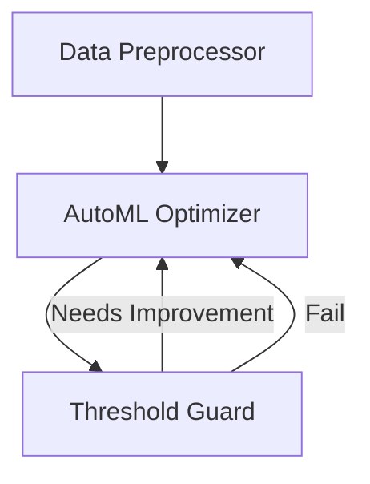

# Agentic Data Science Assistant

## Introduction

This vignette demonstrates the **Data Science Assistant** pattern using
`HydraR`.

In machine learning workflows, hyperparameter tuning is an inherently
iterative process. We can map this paradigm to an `AgentDAG` using the
**Gemini CLI**.

The workflow contains an initial data setup phase followed by a cyclic
model optimization phase: 1. **Data Cleaner Node**: Ingests and prepares
the raw data for analysis. 2. **Model Trainer Node**: Uses an LLM to
recommend hyperparameters and simulate model training. 3. **Evaluator
Node**: Assesses the model’s accuracy. If it falls below a target
threshold, it generates specific refinement feedback and loops back for
re-optimization.

## Setup

``` r

library(HydraR)
```

## Defining the Workflow Components

To keep our architecture clean, we store all workflow components—initial
configuration, LLM prompts, agent roles, and deterministic logic—in a
central registry.

``` r

ds_logic_registry <- list(
  # 0. Initial Configuration
  initial_state = list(
    raw_data = "Titanic_Dataset.csv",
    target_accuracy = 0.85,
    total_evaluations = 0
  ),

  # 1. Deterministic Logic Functions
  logic = list(
    DataCleaner = function(state, params) {
      dataset <- state$get("raw_data")
      clean_data <- paste("Cleaned", dataset)
      list(status = "SUCCESS", output = list(clean_data = clean_data))
    },
    Evaluator = function(state, params) {
      config <- state$get("ModelTrainer")
      target <- state$get("target_accuracy")
      iteration <- state$get("total_evaluations") + 1

      accuracy <- min(0.60 + (iteration * 0.10), 0.95)

      if (accuracy >= target) {
        list(status = "SUCCESS", output = list(
          optimization_complete = TRUE,
          eval_message = sprintf("Target reached: %.2f >= %.2f using config: %s", accuracy, target, config),
          total_evaluations = iteration
        ))
      } else {
        list(status = "SUCCESS", output = list(
          optimization_complete = FALSE,
          eval_message = sprintf("Accuracy %.2f is below %.2f. Recommending new parameters.", accuracy, target),
          total_evaluations = iteration
        ))
      }
    }
  ),

  # 2. LLM Agent Roles
  roles = list(
    ModelTrainer = "You are an AutoML expert. Given a dataset and previous accuracy logs, recommend a new set of hyperparameters."
  ),

  # 3. LLM Prompt Builders
  prompts = list(
    ModelTrainer = function(state) {
      feedback_text <- if (!is.null(state$get("Evaluator"))) sprintf("\nFeedback: %s", state$get("Evaluator")) else ""
      sprintf("Dataset: %s%s\nOutput exactly a model configuration string.", state$get("clean_data"), feedback_text)
    }
  )
)
```

## The Node Factory

We use a factory function to dynamically create nodes based on their
type and parameters defined in the Mermaid graph.

``` r

ds_node_factory <- function(id, label, params) {
  # Driver resolution from Mermaid params
  driver_obj <- if (!is.null(params$driver) && params$driver == "gemini") GeminiCLIDriver$new() else NULL

  if (id %in% names(ds_logic_registry$logic)) {
    # Create a deterministic Logic Node
    AgentLogicNode$new(
      id = id,
      label = label,
      logic_fn = ds_logic_registry$logic[[id]]
    )
  } else {
    # Create an agentic LLM Node
    AgentLLMNode$new(
      id = id,
      label = label,
      role = ds_logic_registry$roles[[id]],
      driver = driver_obj,
      prompt_builder = ds_logic_registry$prompts[[id]]
    )
  }
}
```

## Building the DAG via Mermaid

We define the entire workflow architecture as a Mermaid string. This
string serves as the single source of truth for both structure and node
metadata.

``` r

mermaid_graph <- "
graph TD
  DataCleaner[Data Preprocessor] --> ModelTrainer
  ModelTrainer[AutoML Optimizer | driver=gemini] --> Evaluator
  Evaluator[Threshold Guard] -- Needs Improvement --> ModelTrainer
"

# Instantiate the DAG
dag <- AgentDAG$from_mermaid(mermaid_graph, node_factory = ds_node_factory)

# Add conditional logic for the optimization loop
dag$add_conditional_edge(
  from = "Evaluator",
  test = function(out) isTRUE(out$optimization_complete),
  if_true = NULL, # Done!
  if_false = "ModelTrainer"
)

compiled_dag <- dag$compile()
#> Warning in dag$compile(): Potential infinite loop detected: graph contains
#> cycles. Ensure conditional edges have exit conditions.
#> Graph compiled successfully.
```

## Visualizing the Workflow

``` r

cat("```mermaid\n")
```

``` mermaid

``` r
cat(compiled_dag$plot(type = "mermaid"))
```




``` r

cat("\n```\n")
```


    ## Running the Scenario


    ``` r
    cat("Starting AutoML Pipeline...\n")

    result <- compiled_dag$run(
      initial_state = ds_logic_registry$initial_state,
      max_steps = 10
    )

    cat("\n--- TRAINING PIPELINE COMPLETE ---\n")
    cat("Final Training Config:", result$state$get("ModelTrainer"), "\n")
    cat("Final Accuracy Status:", result$state$get("eval_message"), "\n")

The DAG seamlessly executed the data prep before dropping into an
iterative optimization loop until the target metric was satisfied!
