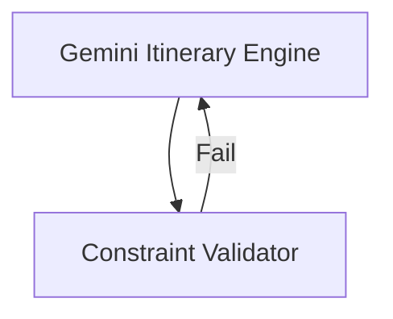

# Agentic Travel Planning: Sydney to Hong Kong

## Introduction

This vignette demonstrates how to use `HydraR` to orchestrate a
high-fidelity travel planning workflow. Unlike simple mock-based agents,
we will use the `GeminiCLIDriver` to drive real-world logic transitions,
state management, and persistence for a complex itinerary.

We will plan a trip from **Sydney (SYD)** to **Hong Kong (HKG)** with
specific airline and activity constraints.

## Scenario Requirements

- **Route**: Sydney to Hong Kong (Departure: 29th May 2026, Return: 5th
  June 2026).
- **Airline**: Qantas (Required).
- **Activities**: Visit Cheung Chau Island, dine at Spaghetti House, and
  sample local Cantonese cuisine.
- **Goal**: Generate a structured 3-day itinerary that respects these
  constraints.

## Setup

First, load the library and initialize the `GeminiCLIDriver`.

``` r

library(HydraR)

# Initialize the Gemini CLI driver
# Note: This assumes the 'gemini' CLI is installed and configured on your system.
driver <- GeminiCLIDriver$new()
```

## Defining the Agent State

We define the initial state, which includes our hard constraints and
preferences.

``` r

initial_state <- list(
  origin = "Sydney",
  destination = "Hong Kong",
  departure_date = "2026-05-26",
  return_date = "2026-06-01",
  airline = "Qantas",
  must_include = c("Cheung Chau Island", "Spaghetti House", "Local Cuisine"),
  itinerary_draft = NULL,
  validation_passed = FALSE
)

state <- AgentState$new(initial_state)
```

## Building the Orchestration Graph

We will define two nodes: 1. **The Planner**: An `AgentLLMNode` that
calls Gemini to generate the itinerary. 2. **The Auditor**: An
`AgentLogicNode` that checks if all “must-include” items are actually in
the draft.

### 1. The Planner Node

We use a `prompt_builder` to inject the state dynamically into the LLM
prompt.

``` r

planner_node <- AgentLLMNode$new(
  id = "TravelPlanner",
  label = "Gemini Itinerary Engine",
  role = "You are a professional travel concierge specializing in premium Hong Kong travel.",
  driver = driver,
  prompt_builder = function(state) {
    sprintf(
      "Plan a 3-day trip from %s to %s.
      Dates: %s to %s.
      Airline: %s.
      Must include: %s.
      Provide a detailed itinerary in Hong Kong.",
      state$get("origin"),
      state$get("destination"),
      state$get("departure_date"),
      state$get("return_date"),
      state$get("airline"),
      paste(state$get("must_include"), collapse = ", ")
    )
  }
)
```

### 2. The Auditor Node

This node uses standard R logic to validate the LLM’s output.

``` r

auditor_node <- AgentLogicNode$new(
  id = "Auditor",
  label = "Constraint Validator",
  logic_fn = function(state) {
    itinerary <- state$get("TravelPlanner") # From the previous LLM node
    if (is.null(itinerary)) itinerary <- ""
    must_include <- state$get("must_include")

    # Simple string matching to check constraints
    found <- sapply(must_include, function(x) grepl(x, itinerary, ignore.case = TRUE))
    found_vec <- unlist(found)

    if (all(found_vec)) {
      list(
        status = "SUCCESS",
        output = list(validation_passed = TRUE, message = "All constraints met!")
      )
    } else {
      missing <- must_include[!found_vec]
      list(
        status = "SUCCESS",
        output = list(
          validation_passed = FALSE,
          message = paste("Missing items:", paste(missing, collapse = ", "))
        )
      )
    }
  }
)
```

## Compiling the DAG

We link the nodes and add a conditional loop. If the Auditor fails, we
go back to the Planner with the missing feedback.

``` r

dag <- AgentDAG$new()
dag$add_node(planner_node)
dag$add_node(auditor_node)

dag$add_edge("TravelPlanner", "Auditor")

# Conditional loop: Back to planner if validation fails
dag$add_conditional_edge(
  from = "Auditor",
  test = function(out) isTRUE(out$validation_passed),
  if_true = NULL, # END
  if_false = "TravelPlanner"
)

dag$set_start_node("TravelPlanner")
compiled_dag <- dag$compile()
#> Graph compiled successfully.
```

## Visualizing the Workflow

We can view the agent’s logic directly using Mermaid.js syntax.

``` r

cat("```mermaid\n")
```

``` mermaid

``` r
cat(compiled_dag$plot(type = "mermaid"))
```




``` r

cat("\n```\n")
```


    ## Execution

    When we run the DAG, `HydraR` manages the state transitions and LLM calls. If the LLM forgets to mention "Spaghetti House", the Auditor will detect it and loop back for a correction.


    ``` r
    # Register a checkpointer for durability
    checkpointer <- AgentCheckpointer$new(path = "travel_booking.duckdb")
    compiled_dag$set_checkpointer(checkpointer)

    # Run the orchestration
    results <- compiled_dag$run(initial_state = initial_state, max_steps = 5)

    # Display final itinerary
    cat(results$state$get("TravelPlanner"))

## Conclusion

This workflow demonstrates how `HydraR` provides: 1. **Dynamic
Prompting**: Injecting complex R state into LLM calls. 2.
**Reliability**: Using logic nodes as “guardrails” for non-deterministic
LLM output. 3. **Persistence**: The ability to checkpoint and resume
complex multi-step planning.

------------------------------------------------------------------------
