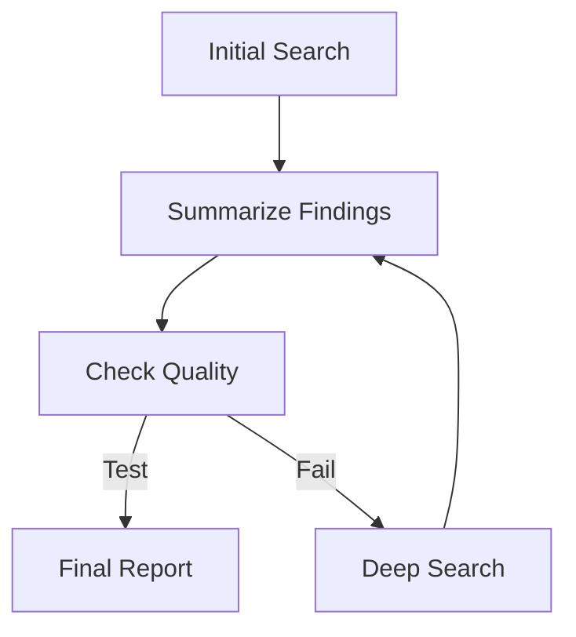

# Mermaid Round-Trip Visualization

This vignette demonstrates how to define an `AgentDAG` using Mermaid
syntax and later generate a status-colored visualization after a run.

## Workflow Spec

We start with a workflow that includes a conditional logic point.



## Setup

## Defining the Workflow Components

To keep our architecture clean, we store all deterministic logic
functions in a central registry.

``` r

round_trip_logic_registry <- list(
  # 1. Deterministic Logic Functions
  logic = list(
    Check = function(state, params = NULL) {
      # A logic node that fails the first time but succeeds the second
      run_count <- state$get("check_runs") %||% 0
      state$set("check_runs", run_count + 1)

      if (run_count == 0) {
        cat("Quality check failed. Routing to ReSearch...\n")
        return(list(status = "SUCCESS", output = FALSE))
      } else {
        cat("Quality check passed!\n")
        return(list(status = "SUCCESS", output = TRUE))
      }
    },
    Default = function(state, params = NULL) {
      list(status = "SUCCESS", output = paste("Result from", state$node_id))
    }
  )
)
```

## The Node Factory

We use a factory function to dynamically resolve nodes. If a specialized
logic function isn’t found, we fall back to a default processing node.

``` r

round_trip_node_factory <- function(id, label, params) {
  logic_fn <- round_trip_logic_registry$logic[[id]] %||% round_trip_logic_registry$logic$Default

  AgentLogicNode$new(
    id = id,
    label = label,
    logic_fn = logic_fn
  )
}
```

## Creating and Running the DAG

Next, we create the DAG from our Mermaid string and run it with a
`max_steps` limit.

``` r

mermaid_spec <- "
graph TD
  Start[Initial Search] --> Summarize[Summarize Findings]
  Summarize --> Check[Check Quality]
  Check --> Publish[Final Report]
  Check --> ReSearch[Deep Search]
  ReSearch --> Summarize
"

# Create DAG from Mermaid
dag <- AgentDAG$from_mermaid(mermaid_spec, node_factory = round_trip_node_factory)

# Add the conditional logic for the quality loop
dag$add_conditional_edge(
  from = "Check",
  test = function(out) out == TRUE,
  if_true = "Publish",
  if_false = "ReSearch"
)

# Run the DAG
results <- dag$run(initial_state = list(check_runs = 0), max_steps = 10)
#> Warning in self$compile(): Potential infinite loop detected: graph contains
#> cycles. Ensure conditional edges have exit conditions.
#> Graph compiled successfully.
#> [Iteration 1] Running Node: Start
#>    [Start] Executing R logic...
#> [Iteration 2] Running Node: Summarize
#>    [Summarize] Executing R logic...
#> [Iteration 3] Running Node: Check
#>    [Check] Executing R logic...
#> Quality check failed. Routing to ReSearch...
#> [Iteration 4] Running Node: ReSearch
#>    [ReSearch] Executing R logic...
#> [Iteration 5] Running Node: Summarize
#>    [Summarize] Executing R logic...
#> [Iteration 6] Running Node: Check
#>    [Check] Executing R logic...
#> Quality check passed!
#> [Iteration 7] Running Node: Publish
#>    [Publish] Executing R logic...
```

## Round-Trip Visualization

After a run, you can generate a **status-colored** Mermaid string using
the `plot(status = TRUE)` method.

``` r

# Export status-colored Mermaid
mermaid_colored <- dag$plot(status = TRUE)
```

    #> ```mermaid
    #> graph TD
    #>   Start["Initial Search (Result from Start)"]
    #>   Summarize["Summarize Findings (Result from Summarize)"]
    #>   Check["Check Quality"]
    #>   Publish["Final Report (Result from Publish)"]
    #>   ReSearch["Deep Search (Result from ReSearch)"]
    #>   Start --> Summarize
    #>   Summarize --> Check
    #>   Check --> Publish
    #>   Check --> ReSearch
    #>   ReSearch --> Summarize
    #>   Check -- Test --> Publish
    #>   Check -- Fail --> ReSearch
    #>   classDef success fill:#c8e6c9,stroke:#2e7d32,stroke-width:2px;
    #>   classDef failure fill:#ff8a80,stroke:#b71c1c,stroke-width:2px;
    #>   classDef active fill:#bbdefb,stroke:#0d47a1,stroke-width:2px;
    #>   classDef pause fill:#fff9c4,stroke:#fbc02d,stroke-width:2px;
    #>   linkStyle 0 stroke:#388e3c,stroke-width:4px;
    #>   linkStyle 1 stroke:#388e3c,stroke-width:4px;
    #>   linkStyle 2 stroke:#388e3c,stroke-width:4px;
    #>   linkStyle 3 stroke:#388e3c,stroke-width:4px;
    #>   linkStyle 4 stroke:#388e3c,stroke-width:4px;
    #>   linkStyle 5 stroke:#388e3c,stroke-width:4px;
    #>   linkStyle 6 stroke:#388e3c,stroke-width:4px;
    #> ```

``` r


# Show the colored Mermaid syntax
cat(mermaid_colored)
```

    #> ```mermaid
    #> graph TD
    #>   Start["Initial Search (Result from Start)"]
    #>   Summarize["Summarize Findings (Result from Summarize)"]
    #>   Check["Check Quality"]
    #>   Publish["Final Report (Result from Publish)"]
    #>   ReSearch["Deep Search (Result from ReSearch)"]
    #>   Start --> Summarize
    #>   Summarize --> Check
    #>   Check --> Publish
    #>   Check --> ReSearch
    #>   ReSearch --> Summarize
    #>   Check -- Test --> Publish
    #>   Check -- Fail --> ReSearch
    #>   classDef success fill:#c8e6c9,stroke:#2e7d32,stroke-width:2px;
    #>   classDef failure fill:#ff8a80,stroke:#b71c1c,stroke-width:2px;
    #>   classDef active fill:#bbdefb,stroke:#0d47a1,stroke-width:2px;
    #>   classDef pause fill:#fff9c4,stroke:#fbc02d,stroke-width:2px;
    #>   linkStyle 0 stroke:#388e3c,stroke-width:4px;
    #>   linkStyle 1 stroke:#388e3c,stroke-width:4px;
    #>   linkStyle 2 stroke:#388e3c,stroke-width:4px;
    #>   linkStyle 3 stroke:#388e3c,stroke-width:4px;
    #>   linkStyle 4 stroke:#388e3c,stroke-width:4px;
    #>   linkStyle 5 stroke:#388e3c,stroke-width:4px;
    #>   linkStyle 6 stroke:#388e3c,stroke-width:4px;
    #> ```

> \[!NOTE\] The `plot(status = TRUE)` method uses the internal trace log
> to color nodes by their outcome: **Green** for success, **Red** for
> failure, and **Blue** for active paths.
