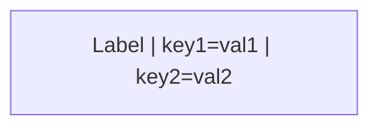

# HydraR Orchestration Manual

HydraR is an R6-based multi-agent orchestration framework designed for APAF Bioinformatics. It allows for the declarative definition of complex workflows involving AI agents (LLMs) and deterministic R logic through Mermaid-centric diagrams and YAML definitions.

---

## 1. YAML Workflow Anatomy

HydraR workflows are typically defined in `.yml` files. These files provide the high-level orchestration, logic components, and initial state for the Agent Graph (DAG).

### Root Keys

| Key | Purpose |
| :--- | :--- |
| **`graph`** | A Mermaid string (e.g., `graph TD`) defining the network topology. This is the source of truth for node IDs and edges. |
| **`conditional_edges`** | Defines branching logic where the next node depends on the output of a previous node (e.g., Success/Failure loops). |
| **`roles`** | A dictionary of AI personas/system prompts referenced by `role_id`. |
| **`logic`** | A dictionary of R code blocks (logic functions) or character strings (prompt templates). |
| **`start_node`** | Explicit entry point for the graph (optional, defaults to root nodes). |
| **`initial_state`** | The seed data injected into the `AgentState` before execution begins. |

### Example: The Travel Itinerary Planner Vignette
```yaml
graph: |
  graph TD
    Planner["Travel Planner | type=llm | driver=gemini_api | role_id=concierge"]
    Validator["Auditor | type=logic | logic_id=check_fn"]
    Planner --> Validator
    Validator --> Planner

conditional_edges:
  Validator:
    test: "isTRUE(out$passed)"
    if_true: "NextNode"
    if_false: "Planner"

roles:
  concierge: "You are a professional travel assistant..."

logic:
  check_fn: |
    {
      list(status = "success", output = list(passed = TRUE))
    }
```

---

## 2. Node Technical Gallery

HydraR uses specialized R6 classes (inheriting from `AgentNode`) to handle different types of tasks.

### `type=llm` (AgentLLMNode)
The primary node for interacting with Large Language Models.
- **Role**: Combines a system prompt (`role`) and user input into an LLM call.
- **Key Parameters**:
    - **`driver`**: The primary execution engine. See the [Driver Technical Gallery](#3-available-drivers-driver) for all options.
    - `role_id`: Lookup key in the `roles` section.
    - `prompt_id`: (Optional) Lookup key for a logic function that builds the prompt dynamically.
    - `model`: Override the default driver model.

---

## 3. Available Drivers (`driver=`)

The `driver` parameter determines how HydraR interacts with an LLM. Drivers are categorized by **Provider** and **Execution Mode** (Cloud API vs. Local CLI).

### Google (Gemini)
| Shorthand | Class | Description |
| :--- | :--- | :--- |
| `gemini_api` | `GeminiAPIDriver` | **Cloud API.** Uses the Google AI Studio API. Fast, reliable, and supports long contexts. Requires `GOOGLE_API_KEY`. |
| `gemini` | `GeminiCLIDriver` | **CLI Mode.** Uses the local `gemini` command-line tool. Ideal for environments where the CLI provides better tool-use or sandbox capabilities. |
| `gemini_image`| `GeminiImageDriver`| **Multimodal.** Specialized API driver for generating images (tested with `gemini-3.1-flash-image-preview`). |

### Anthropic (Claude)
| Shorthand | Class | Description |
| :--- | :--- | :--- |
| `claude` | `AnthropicCLIDriver` | **CLI Mode.** Uses the `claude` CLI tool. Primarily used for autonomous coding tasks and localized context. |
| `anthropic_api`| `AnthropicAPIDriver` | **Cloud API.** Direct interaction with Anthropic's Messages API. Requires `ANTHROPIC_API_KEY`. |

### OpenAI (GPT)
| Shorthand | Class | Description |
| :--- | :--- | :--- |
| `openai` | `OpenAICodexCLIDriver` | **CLI Mode.** Uses the official OpenAI `codex` CLI (v0.118+). High-performance coding agent for local tasks. |
| `openai_api` | `OpenAIAPIDriver` | **Cloud API.** Standard OpenAI Chat Completions driver. Supports GPT-5.4 flagship and mini models. Requires `OPENAI_API_KEY`. |


### Local & Open Source
| Shorthand | Class | Description |
| :--- | :--- | :--- |
| `ollama` | `OllamaDriver` | **Local CLI.** Interfaces with the `ollama` tool. Allows running Llama 3, Mistral, and other models entirely on the user's hardware. |

### GitHub
| Shorthand | Class | Description |
| :--- | :--- | :--- |
| `copilot_cli` | `CopilotCLIDriver` | **CLI Mode.** Uses the `gh copilot` extension. Useful for generating shell commands and git-related logic. |

### `type=logic` (AgentLogicNode)
Executes deterministic R code.
- **Role**: Data validation, file I/O, template rendering, and decision gates.
- **Key Parameters**:
    - `logic_id`: Reference to a function in the `logic` section.

### `type=router` (AgentRouterNode)
A decision-based node that dynamically selects the next node.
- **Role**: Complex branching where simple "Success/Failure" is insufficient.
- **Requirement**: The R logic must return `list(target_node = "NODE_ID")`.

### `type=map` (AgentMapNode)
Iterates over a list in the current state.
- **Role**: Batch processing (e.g., generating images for multiple locations).
- **Key Parameters**:
    - `map_key`: The state key containing the list to iterate over.
    - `logic_id`: The function to run for each item.

### `type=observer` (AgentObserverNode)
Executes logic for side-effects without modifying the main state.
- **Role**: Non-blocking audits, logging, or notifications.
- **State**: Receives a **read-only** restricted state to prevent state corruption.

### `type=merge` (MergeHarmonizer)
Synchronizes parallel execution paths.
- **Role**: Merges changes from isolated git worktrees back into the base branch.
- **Automatic**: Triggered by the orchestrator when parallel branches converge.

---

## 4. Orchestration Syntax

Workflow parameters are injected directly into Mermaid labels using the `|` separator.

### Mermaid Syntax


### Parameter Resolution
HydraR's `auto_node_factory()` resolves these value types automatically:
| Syntax | Interpretation |
| :--- | :--- |
| `retries=3` | Numeric |
| `isolation=true` | Logical |
| `model=null` | NULL (NULL in R) |
| `role=Chef` | String |

---

## 5. Resiliency & Execution Control

HydraR is designed for high-availability systems where LLM calls might fail or time out.

### Retries & Timeouts
- **`retries`**: Number of attempts before a node is marked as `failed`.
- **`timeout`**: Maximum execution time in seconds.

### 5.2 Resilient Failover (Error Edges)

Standard edges represent the nominal execution path (i.e., the primary success flow) of a workflow. However, in agentic systems, failures are expected e.g. models might reach safety limits, context windows might overflow, or external APIs might time out. 

HydraR handles these through **Error Edges**, which are prioritized failover paths triggered only when a node returns a `failed` or `error` status.

#### Edge Syntax & Visual Representation

| Syntax | Interpretation | Visual | Use Case |
| :--- | :--- | :--- | :--- |
| `A --> B` | Standard Transition | Green/Solid | Normal workflow progression. |
| `A -- "Test" --> B` | Success Path | Green/Solid | Conditional branch if a test passes. |
| `A -- "Fail" --> C` | Failure Path | Yellow/Solid | Logic-driven negative branch (e.g., "invalid input"). |
| `A -- "error" --> D` | **Error Path** | **Red/Dashed** | **Failover** for unhandled exceptions or agent crashes. |

#### How It Works (The "Orchestrator Search")
When a node finishes execution, the `AgentOrchestrator` resolves the next node in this strict order of priority:
1.  **Error Edge**: If status is `failed` or `error` and an `error` edge exists, it is taken immediately.
2.  **Router Output**: If the node is a `type=router`, it follows the returned `target_node`.
3.  **Conditional Logic**: Evaluates the `conditional_edges` (Test/Fail).
4.  **Standard Edges**: Default Mermaid transitions.

#### When to Use Failover Nodes

Consider using error edges in the following scenarios:
*   **Model Tiering**: If a high-reasoning model (e.g., `gpt-4o`) fails due to rate limits or complexity, failover to a smaller, faster model (e.g., `gemini-1.5-flash`) to finish the task.
*   **Human-In-The-Loop (HITL)**: Route errors to a node that sets `status="pause"`. This stops the DAG and allows a human operator to inspect the state and manually correct it before resuming.
*   **State Sanitization**: Redirect to a logic node that scrubs corrupted state variables or resets "attempt counters" before looping back to the beginning.

#### Failover as Defensive Programming
In the APAF philosophy, error edges are a form of **Defensive Orchestration**. Instead of letting a single node failure crash a multi-hour bioinformatics pipeline, defensive programming with failover ensures:
1.  **Graceful Degradation**: The system attempts a simpler path rather than total failure.
2.  **Auditability**: Failover events are recorded in the `trace_log`, making it clear where the execution deviated from the nominal flow.
3.  **Resilience**: The pipeline can recover from transient AI "hallucinations" or API glitches without manual intervention.

---

## 6. Isolation & Parallelism (Advanced)

HydraR supports running complex branches in parallel using **Git Worktrees**.

### `isolation=true`
When a node is marked with `isolation=true`, HydraR:
1.  Creates a new git worktree (sandbox).
2.  Moves the node execution into that directory.
3.  Prevents file-system conflicts between parallel agents.

### Convergent Merging
When parallel isolated nodes converge, use a `MergeHarmonizer` (usually registered as `type=merge`) to reconcile the file changes back into the main branch.

---

---

## 7. Validation & Compliance

HydraR is designed for critical bioinformatics workflows and enforces a strict safety-first policy. Every time a workflow is loaded via `spawn_dag()`, it undergoes a holistic validation process.

### Deep Integrated Validation
HydraR checks your entire workflow for consistency:
- **Resource Linking**: Confirms that all `role_id` and `logic_id` references in the Mermaid graph exist in the YAML `roles:` and `logic:` sections.
- **Topology Sync**: Ensures that your visual labels and YAML `conditional_edges` are perfectly synchronized. No "blind" logic branches are allowed.
- **Syntactic Parsing**: All R code blocks are parsed at load-time. If a code block has a syntax error (e.g., missing bracket), HydraR will throw a hard stop before execution.

### APAF Rule G-25 Enforcement
To ensure reproducible and high-performance data processing, HydraR enforces the **"Zero-Tolerance for Imperative Loops"** policy.
- **Linting**: If a `for` loop is detected in an R logic block, HydraR will issue a warning. 
- **Recommendation**: Always use the `purrr` family (`map`, `walk`, `imap`) or `lapply()`.

### Static Analysis (Lintr)
HydraR integrates with the `lintr` package to provide deep static analysis of your R logic, flagging potential issues like:
- Undefined variables.
- Unused parameters.
- Stylistic inconsistencies.

> [!TIP]
> Refer to the **[HydraR Validation Reference](file:///Users/ignatiuspang/Workings/2026/HydraR/notes/HydraR_Validation_Reference.md)** for a full list of all supported errors and warnings.

---

> [!IMPORTANT]
> **Deduplication**: Parameters are parsed from the **first** definition of a node ID in the Mermaid graph. Subsequent mentions of the ID inherit those settings.

> [!TIP]
> **Context Injection**: Every LLM node automatically tries to inject `agents.md` and `skills.md` from the current directory if they exist, ensuring project standards are enforced by default.

---

## 8. Advanced Syntax & Logic Resolution

### 3-Tier Logic Resolution Strategy
When you define a `logic_id` or `prompt_id`, HydraR resolves the value using a hierarchical strategy:
1.  **Tier 1 (File)**: If the value is a string ending in `.R` and exists on disk, it is `source()`-ed.
2.  **Tier 1.5 (Symbol)**: HydraR checks if the string matches an existing R function name in the environment.
3.  **Tier 2 (Code Snippet)**: If neither, the string is treated as raw R code and automatically wrapped in `function(state) { ... }`, providing direct access to the `state` object.

### YAML Syntax: Block Scalars
Workflow manifests use specific YAML block scalars to manage multi-line strings correctly:

#### 1. Literal Block Scalar (`|`)
*   **Usage**: `graph:`, `logic:`
*   **Behavior**: Preserves all newlines and indentation exactly.
*   **Why**: Mermaid and R code blocks are line-sensitive; using `|` ensures the structure is preserved.

#### 2. Folded Block Scalar (`>`)
*   **Usage**: `roles:`, `prompt_templates:` (LLM prompts)
*   **Behavior**: Folds single newlines into spaces but preserves double newlines (paragraphs).
*   **Why**: Allows long prompts to be readable in YAML without injecting line breaks into the LLM context.

### The Tab Taboo: Tab-Zero Tolerance

> [!DANGER]
> **TAB characters are strictly forbidden for indentation in YAML.**

*   **Parser Failure**: `yaml::read_yaml()` will throw a syntax error if an actual Tab (`	`) is detected.
*   **Recommendation**: Always use **2 or 4 Spaces** for indentation.

---

## 9. Model Context Protocol (MCP)

HydraR supports the **Model Context Protocol (MCP)** via a pass-through architecture. This allows agents to leverage external tools (databases, APIs, local files) using native MCP clients built into CLI drivers.

### 9.1 Pass-Through Architecture
HydraR does not act as an MCP Client itself; instead, it orchestrates agents that may have their own MCP configurations. This keeps the R-based state management clean and decoupled from the specific tool-use implementations of the LLM provider.

### 9.2 Noise Filtering
Agent drivers (e.g., `gemini`, `claude`) are **MCP-aware**. They automatically strip MCP status messages and tool-use logs from the final model output to prevent them from corrupting the R code or state updates.
*   **Filtered Patterns**: `Scheduling MCP`, `Executing MCP`, `Received tool update`, `Refreshed context`, etc.

### 9.3 Configuration via `cli_opts`
You can enable and configure MCP servers by passing provider-specific flags in the `cli_opts` of an `AgentLLMNode`.

| Provider | Flag | Purpose |
| :--- | :--- | :--- |
| **Claude** | `mcp_config` | Path to a valid `claude_desktop_config.json`. |
| **Gemini** | `allowed_mcp_server_names` | A list of permitted MCP server identifiers. |

#### Example: Configuring an MCP SQL Server
```yaml
graph: |
  graph TD
    DBAgent["Query Node | type=llm | driver=anthropic | model=claude-3-5-sonnet-latest"]

logic:
  DBAgent:
    cli_opts:
      mcp_config: "/etc/hydrar/mcp/sql_config.json"
      permission_mode: "bypassPermissions"
```

---

<!-- APAF Bioinformatics | HydraR_Orchestration_Manual | Approved | 2026-04-03 -->
