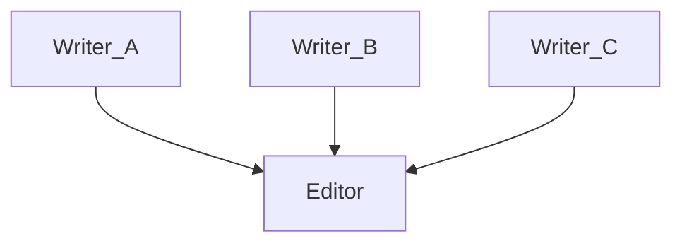

# Fan-In Implementation & Execution Strategy

Deep dive into how HydraR handles multi-parent dependencies and synchronization.

In **HydraR**, the "fan-in" behavior (multiple agents feeding into a single orchestrator/editor) is a byproduct of how the `AgentDAG` orchestrator manages node dependencies and execution waves.

## Orchestration Logic

The fan-in node (like an "Editor" or "Synthesizer") is **not** active and waiting in the background. Instead, it is **invoked** by the `AgentDAG` runner only when the graph determines it is "their turn." 

How it knows "its turn" depends on which execution mode the DAG is using:

### 1. Pure DAG (Linear Execution)
If your workflow has no loops or conditional "failover" paths, HydraR uses **Topological Sorting** (via `igraph::topo_sort`).
- **The Logic**: Before running, the orchestrator calculates a linear sequence where every node is guaranteed to appear **after all its parents**.
- **Fan-In Resolution**: A node with 3 parents is simply placed at the end of that sequence. The runner executes the parents one by one (or in a parallel block), and once all are done, it moves to the next node in the list—the fan-in node.
- **State Readiness**: Because the parents have already run, their results are already committed to the `AgentState`. When the fan-in node starts, it just reads those keys directly.

### 2. Complex/Parallel Execution (Iterative Execution)
If you are using parallel **Git Worktrees** or have conditional loops, HydraR uses a "Wave-based" engine:
- **Wave Synchronization**: In `dag.R`, the `.run_iterative` method processes nodes in "waves" (`current_nodes`). 
- **Parallel Barrier**: When running branches in parallel (e.g., using `furrr`), the orchestrator uses a **synchronization barrier**. It waits for *all* nodes in the current parallel wave to finish before calculating the `next_queue`.
- **Triggering**: A fan-in node is added to the `next_queue` as soon as its parent nodes complete their execution in the current wave. Since the runner unique-ifies the queue (`unique(next_queue)`), even if 3 parents point to the same child, that child only runs once in the **very next wave** after its parents are done.

## How the Node "Knows" to Start Compute
The node itself is "dumb"—it doesn't monitor its parents. The **`AgentDAG` Orchestrator** is the "brain" that:
1. Checks if a node is reachable and un-executed.
2. Ensures parallel workers have returned and merged their results (if using `MergeHarmonizer`).
3. Calls the node's `run()` method with the up-to-date `AgentState`.

## Synthetic Example
In a fan-in scenario like this:

The **Editor** node "starts compute" because the DAG runner reaches it in the iteration loop. Inside its logic, it simply pulls the dependencies it expects:

```r
register_logic("prompt_editor", function(state) {
  sprintf(
    "Synthesize these three scenes:\n\nAction: %s\n\nMystery: %s\n\nRomance: %s",
    state$get("writer_action"), # Result from Parent A
    state$get("writer_mystery"), # Result from Parent B
    state$get("writer_romance")  # Result from Parent C
  )
})
```

---
<!-- APAF Bioinformatics | notes/fan_in_implementation.md | Approved | 2026-04-06 -->
