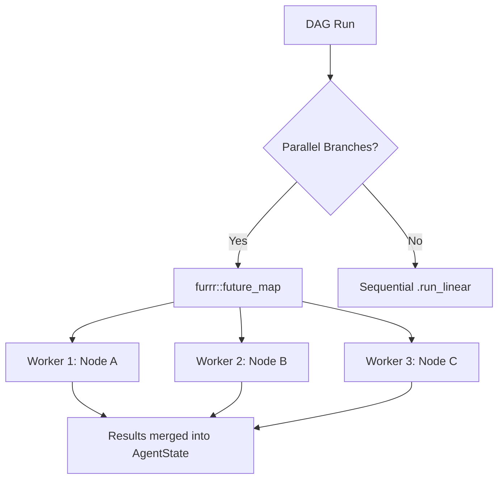
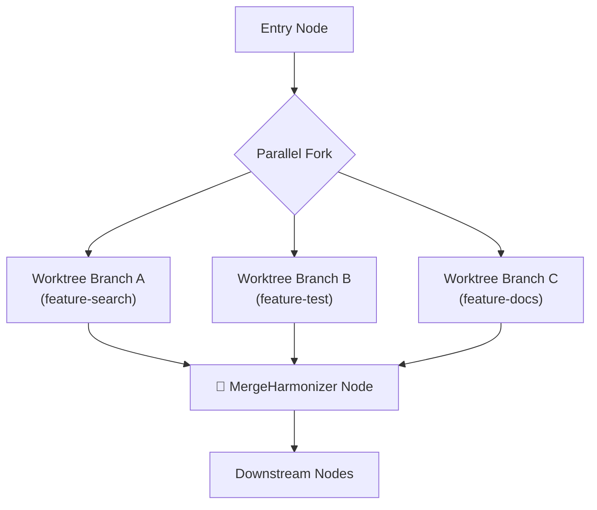

# Git Worktree Analysis for HydraR Parallel Branch Processing

> **Date**: 2026-03-29
> **Context**: HydraR uses `furrr::future_map` for parallel DAG branch execution. This analysis evaluates git worktree integration.

---

## 1. Git Worktree Support Across CLIs

| CLI Tool | Worktree Flag | Status | Mechanism |
|----------|--------------|--------|-----------|
| **Gemini CLI** | `--worktree` / `-w` | ✅ Experimental | Creates worktree under `.gemini/worktrees/`. Requires `experimental.worktrees: true` in `settings.json`. |
| **Claude Code** | No direct flag | ✅ Via workflow pattern | Uses standard `git worktree add`. Sub-agents can be configured with `isolation: worktree` in `.claude/agents/`. |
| **Copilot CLI** | VS Code integration | ✅ Via "Worktree isolation" option | VS Code automates `git worktree add` when starting Copilot sessions. |
| **Ollama** | ❌ N/A | ❌ Not applicable | Ollama is a model server, not a code agent. Has no filesystem awareness. |

### Key Differences

- **Gemini**: Only CLI with a native `--worktree` flag — creates both the directory and branch in one shot.
- **Claude**: Relies on manual `git worktree add` or orchestrator scripts. The agent then runs inside that directory.
- **Copilot**: VS Code-level integration. The CLI itself doesn't have a `--worktree` flag; the IDE manages it.
- **Ollama**: Irrelevant — it's a pure LLM inference server with no filesystem/git awareness.

---

## 2. Is Git Worktree Useful for HydraR?

### Current Architecture



HydraR currently uses `furrr::future_map` to parallelize **independent DAG branches**. Each branch runs a node's `$run()` method which calls an LLM via `system2()`. The results merge back into a shared `AgentState`.

### When Worktrees ARE Useful

> [!IMPORTANT]
> Git worktrees are useful when **parallel branches need to modify files on disk** independently — which is the case when CLI agents (Gemini, Claude, Copilot) are performing **code generation, editing, or tool-use tasks**.

| Scenario | Need Worktree? | Reason |
|----------|:-----------:|--------|
| Parallel LLM Q&A (text-only) | ❌ | No file modifications involved |
| Parallel code generation tasks | ✅ | Each agent needs its own isolated file tree |
| Parallel code review/testing | ✅ | Each branch runs its own test suite in isolation |
| Mixed: some nodes edit files, some don't | ⚠️ | Only file-editing nodes need worktrees |

### When Worktrees Are NOT Useful

- **Pure prompt→response flows** (academic research, summarization, Q&A) — no files are being modified.
- **API-based drivers** (OpenAI, Anthropic, Gemini API) — these don't touch the filesystem at all.
- **Ollama** — local inference only, no file awareness.

### The Core Problem Without Worktrees

If two parallel `furrr` workers both invoke `gemini --worktree` or `claude` in the **same directory**, they will:
1. Compete for file locks
2. Overwrite each other's edits
3. Corrupt the git index

Git worktrees solve this by giving each worker its own checkout.

---

## 3. Do We Need a Merge/Harmonize Node?

> [!WARNING]
> **Yes, absolutely.** If parallel branches create separate git worktrees with independent commits, those branches MUST be reconciled before the DAG can proceed downstream.

### The Reconciliation Problem



Without a harmonization step, you end up with N orphaned branches and no unified state.

### Proposed Architecture: `WorktreeManager` + `MergeHarmonizer`

#### Component 1: `WorktreeManager` (R6 Class)

Manages the lifecycle of git worktrees for parallel branches.

```r
WorktreeManager <- R6::R6Class("WorktreeManager",
  public = list(
    repo_root = NULL,
    worktrees = list(),  # Named list: node_id -> worktree_path
    base_branch = NULL,

    initialize = function(repo_root = getwd(), base_branch = "main") {
      self$repo_root <- repo_root
      self$base_branch <- base_branch
    },

    # Create an isolated worktree for a node
    create = function(node_id, branch_name = NULL) {
      branch <- branch_name %||% paste0("hydra-", node_id, "-", substr(digest::digest(Sys.time()), 1, 8))
      wt_path <- file.path(self$repo_root, ".hydra_worktrees", branch)

      system2("git", c("worktree", "add", "-b", branch, wt_path, self$base_branch),
              stdout = TRUE, stderr = TRUE)

      self$worktrees[[node_id]] <- list(path = wt_path, branch = branch)
      wt_path
    },

    # Get the working directory for a node
    get_path = function(node_id) {
      self$worktrees[[node_id]]$path
    },

    # Get the branch name for a node
    get_branch = function(node_id) {
      self$worktrees[[node_id]]$branch
    },

    # Remove a worktree (cleanup)
    remove = function(node_id) {
      wt <- self$worktrees[[node_id]]
      if (!is.null(wt)) {
        system2("git", c("worktree", "remove", "--force", wt$path),
                stdout = TRUE, stderr = TRUE)
        self$worktrees[[node_id]] <- NULL
      }
    },

    # Remove all worktrees
    cleanup = function() {
      purrr::walk(names(self$worktrees), ~self$remove(.x))
    }
  )
)
```

#### Component 2: `MergeHarmonizer` Node

An `AgentLogicNode` that merges all worktree branches back into the base branch.

```r
# Factory function for creating a merge harmonizer node
create_merge_harmonizer <- function(id = "merge_harmonizer",
                                     strategy = "sequential",
                                     conflict_resolution = "ours") {
  AgentLogicNode$new(
    id = id,
    label = "Merge Harmonizer",
    logic_fn = function(state) {
      wt_manager <- state$get("__worktree_manager__")
      if (is.null(wt_manager)) {
        return(list(status = "SKIP", output = "No worktree manager — nothing to merge."))
      }

      base_branch <- wt_manager$base_branch
      repo_root <- wt_manager$repo_root
      merge_results <- list()

      # Strategy: sequential merge (safe) or octopus merge (fast)
      if (strategy == "sequential") {
        merge_results <- purrr::imap(wt_manager$worktrees, function(wt, node_id) {
          branch <- wt$branch
          # Attempt merge
          res <- system2("git", c("-C", repo_root, "merge", "--no-ff",
                                   paste0("--strategy-option=", conflict_resolution),
                                   branch),
                         stdout = TRUE, stderr = TRUE)
          exit_code <- attr(res, "status") %||% 0L

          if (exit_code != 0L) {
            # Auto-resolve or flag for human review
            list(node_id = node_id, branch = branch, status = "CONFLICT",
                 detail = paste(res, collapse = "\n"))
          } else {
            list(node_id = node_id, branch = branch, status = "MERGED")
          }
        })
      } else if (strategy == "octopus") {
        branches <- purrr::map_chr(wt_manager$worktrees, "branch")
        res <- system2("git", c("-C", repo_root, "merge", "--no-ff", branches),
                       stdout = TRUE, stderr = TRUE)
        merge_results <- list(list(branches = branches, status = "MERGED",
                                    detail = paste(res, collapse = "\n")))
      }

      # Cleanup worktrees
      wt_manager$cleanup()

      conflicts <- purrr::keep(merge_results, ~.x$status == "CONFLICT")
      if (length(conflicts) > 0) {
        return(list(
          status = "CONFLICT",
          output = list(merge_results = merge_results, conflicts = conflicts)
        ))
      }

      list(status = "SUCCESS", output = list(merge_results = merge_results))
    }
  )
}
```

#### Integration with DAG Parallel Execution

The DAG's `.run_iterative()` would need a **worktree-aware fork** that:

1. Before forking: Creates worktrees via `WorktreeManager$create()` for each parallel branch node
2. During execution: Passes the worktree path to each CLI driver (e.g., `gemini -w <path>` or `cd <path> && claude ...`)
3. After joining: Runs the `MergeHarmonizer` node to reconcile branches

```r
# Example DAG with worktree-isolated parallel branches
dag <- AgentDAG$new()

# Setup node: creates worktrees
dag$add_node(AgentLogicNode$new(
  id = "setup_worktrees",
  logic_fn = function(state) {
    wt_mgr <- WorktreeManager$new()
    wt_mgr$create("search_agent")
    wt_mgr$create("test_agent")
    wt_mgr$create("docs_agent")
    state$set("__worktree_manager__", wt_mgr)
    list(status = "SUCCESS", output = NULL)
  }
))

# Parallel branch nodes (each runs in its own worktree)
dag$add_node(AgentLLMNode$new(
  id = "search_agent",
  driver = GeminiCLIDriver$new(),
  cli_opts = list(),  # worktree path injected at runtime
  ...
))

dag$add_node(AgentLLMNode$new(
  id = "test_agent",
  driver = ClaudeCodeDriver$new(),
  ...
))

dag$add_node(AgentLLMNode$new(
  id = "docs_agent",
  driver = CopilotCLIDriver$new(),
  ...
))

# Merge harmonizer (runs after all parallel branches complete)
dag$add_node(create_merge_harmonizer())

dag$add_edge("setup_worktrees", "search_agent")
dag$add_edge("setup_worktrees", "test_agent")
dag$add_edge("setup_worktrees", "docs_agent")
dag$add_edge("search_agent", "merge_harmonizer")
dag$add_edge("test_agent", "merge_harmonizer")
dag$add_edge("docs_agent", "merge_harmonizer")

dag$run(initial_state, max_steps = 30)
```

---

## 4. Merge Strategies

| Strategy | When to Use | Pros | Cons |
|----------|------------|------|------|
| **Sequential** (`merge --no-ff`) | Different files modified per branch | Safe, clear history | Slower, N merge commits |
| **Octopus** (`merge branch1 branch2 ...`) | Non-overlapping changes | Single merge commit | Fails on any conflict |
| **Rebase + Squash** | Clean linear history desired | Clean history | Rewrites history |
| **Cherry-pick** | Only specific commits needed | Selective | Manual, error-prone |
| **LLM-Assisted** | Semantic conflicts | Smart resolution | Expensive, unreliable |

> [!TIP]
> For HydraR's use case, **sequential merge with `--strategy-option=ours`** as a fallback is the safest default. Each parallel branch should be scoped to non-overlapping file paths to minimize conflicts.

---

## 5. How Do CLIs Know Which Git Repository They're Working With?

> [!IMPORTANT]
> **All CLI coding agents discover their git repository by walking up from their current working directory (`cwd`) looking for a `.git/` directory or `.git` file.** This is the fundamental mechanism — there is no explicit "repo" parameter passed to any of them.

### The Discovery Chain

```
CLI process starts in /some/path/
   ↓
Looks for .git/ in /some/path/
   ↓ (not found)
Looks for .git/ in /some/
   ↓ (not found)
Looks for .git/ in /
   ↓ (found or error)
Uses that as the repo root
```

### Per-CLI Details

| CLI | Repo Discovery | Worktree Awareness |
|-----|---------------|--------------------|
| **Gemini CLI** | `cwd` → walks up to `.git/`. Native `--worktree` creates `.gemini/worktrees/<name>` | Worktree has a `.git` *file* pointing to main repo's `.git/worktrees/<name>/` |
| **Claude Code** | `cwd` → walks up to `.git/`. Uses `--add-dir` for extra allowed directories | Worktree directory is a valid git checkout — Claude operates on it transparently |
| **Copilot CLI** | `cwd` → walks up to `.git/`. Uses `--add-dir` for extra directories | Same as Claude — worktree is just another directory with git context |
| **Ollama** | No git awareness | N/A |
| **API Drivers** | No git awareness | N/A |

### What This Means for HydraR + `system2()`

R's `system2()` **inherits the R process's working directory** (`getwd()`). This means:

1. **Without worktrees**: All parallel `furrr` workers share `getwd()` → all CLIs see the same repo/branch → file conflicts.
2. **With worktrees**: Each worker must `cd` into its worktree path before invoking the CLI.

**Critical**: `system2()` does **not** have a `cwd` parameter. The workaround is:
```r
# Option A: withr (clean, recommended)
withr::with_dir(wt_path, {
  system2("gemini", args = c("-p", "-", formatted_opts), stdin = tmp_prompt, stdout = TRUE)
})

# Option B: Shell wrapper (works without withr dependency)
system2("sh", c("-c", sprintf("cd %s && gemini -p - %s < %s",
  shQuote(wt_path), paste(formatted_opts, collapse = " "), shQuote(tmp_prompt))),
  stdout = TRUE, stderr = TRUE)
```

---

## 6. Driver-Level Changes Required

### 6.1 `AgentDriver` Base Class — New `working_dir` Field

The base class needs a `working_dir` field that, when set, makes `call()` execute in that directory:

```r
AgentDriver <- R6::R6Class("AgentDriver",
  public = list(
    id = NULL,
    provider = NULL,
    model_name = NULL,
    supported_opts = character(0),
    validation_mode = "warning",
    working_dir = NULL,     # NEW: Optional worktree/repo path

    initialize = function(id, provider = "unknown", model_name = "unknown",
                          validation_mode = "warning", working_dir = NULL) {
      # ... existing init ...
      self$working_dir <- working_dir
    },

    # NEW: Execute a system2 call in the correct directory
    exec_in_dir = function(command, args, ...) {
      if (!is.null(self$working_dir)) {
        withr::with_dir(self$working_dir, {
          system2(command, args, ...)
        })
      } else {
        system2(command, args, ...)
      }
    },

    # Existing methods...
    call = function(prompt, model = NULL, cli_opts = list(), ...) {
      stop("Abstract Method")
    }
  )
)
```

### 6.2 CLI Drivers — Updated `call()` Methods

Each CLI driver replaces `system2()` with `self$exec_in_dir()`:

```r
# GeminiCLIDriver$call()
call = function(prompt, model = NULL, cli_opts = list(), ...) {
  # ... build args ...
  res <- self$exec_in_dir("gemini", args = c("-p", "-", formatted_opts),
                          stdin = tmp_prompt, stdout = TRUE, stderr = TRUE)
  # ...
}

# ClaudeCodeDriver$call()
call = function(prompt, model = NULL, cli_opts = list(), ...) {
  # ... build args ...
  res <- self$exec_in_dir("claude", args = formatted_opts,
                          stdin = tmp_prompt, stdout = TRUE, stderr = TRUE)
  # ...
}
```

### 6.3 API Drivers — No Changes Needed

API drivers (`OpenAIDriver`, `AnthropicDriver`, `GeminiAPIDriver`) use `httr2` HTTP calls — they have **no filesystem interaction**, so `working_dir` is irrelevant for them.

### 6.4 Ollama — No Changes Needed

Ollama is a pure inference server. It receives a prompt over stdin and returns text — no git or file awareness.

### 6.5 Summary of Driver Changes

| Component | Change | Impact |
|-----------|--------|--------|
| `AgentDriver` (base) | Add `working_dir` field + `exec_in_dir()` method | All subclasses inherit |
| `GeminiCLIDriver` | Replace `system2()` → `self$exec_in_dir()` | Worktree-aware |
| `ClaudeCodeDriver` | Replace `system2()` → `self$exec_in_dir()` | Worktree-aware |
| `CopilotCLIDriver` | Replace `system2()` → `self$exec_in_dir()` | Worktree-aware |
| `OllamaDriver` | Can optionally use `exec_in_dir()` for consistency | No functional change |
| `AgentAPIDriver` | No change | N/A |
| `DESCRIPTION` | Add `withr` to `Imports:` | Dependency |

---

## 6. Recommendations

1. **Don't enable worktrees by default** — only when nodes perform file-modifying code generation tasks.
2. **Add a `WorktreeManager` R6 class** — manages lifecycle (create/list/cleanup).
3. **Add a `MergeHarmonizer` logic node** — a standard DAG node that merges branches after parallel fork joins.
4. **Add `worktree_path` field to `AgentDriver`** — optional field that, when set, makes the driver execute inside that worktree.
5. **Scope parallel branches to non-overlapping paths** — the DAG designer should assign each branch to different directories/files.
6. **Add cleanup logic** — `on.exit()` or finalizer to remove worktrees even on DAG failure.

---

## 7. Resolved Design Decisions

All open questions have been resolved. Decisions are final.

### D1. Scope → Optional Extension with Core Hooks

- Worktree support lives in **`R/worktree.R`** (separate file)
- Core hooks added to `dag.R`: optional `worktree_manager` field on `AgentDAG`
- Follows the established pluggable pattern (like `Checkpointer` and `MessageLog`)
- Keeps `dag.R` clean; bioinformatics users enable isolation, general users skip it

### D2. Conflict Policy → All Three Options, LLM Default

- **`ConflictResolver`** R6 class with `strategy` field: `"llm"` | `"human"` | `"ours"`
- Default: `"llm"` (semantic resolve via the node's driver)
- `"human"` → triggers `status = "pause"` (existing HITL mechanism)
- `"ours"` → `git merge --strategy-option=ours` for deterministic batch processing

### D3. Worktree Management → HydraR Manages Uniformly

- **HydraR owns all worktrees** via `git worktree add` — no driver-specific worktree flags
- Gemini's native `--worktree` flag is **ignored**; the CLI runs inside HydraR's worktree directory
- Ensures uniform branch naming, cleanup policy, and conflict strategy across all drivers
- Enables hot-swap: swapping a Gemini node to Claude doesn't change isolation logic

### D4. Branch Naming → `hydra/{thread_id}/{node_id}-{short_hash}`

- Hierarchical: `hydra/run-abc123/search_agent-7f3a2b1`
- Thread scoping: `git branch -D hydra/run-abc123/*` cleans an entire run
- Git GUIs render `/` as folders for visual organization
- Configurable `branch_prefix` field on `WorktreeManager` (default: `"hydra"`)

### D5. Cleanup Timing → Policy-Based (Keep on Failure, Clean on Success)

- `cleanup_policy` field: `"auto"` | `"none"` | `"aggressive"`
- **`"auto"` (default)**: Delete on success, preserve on failure/conflict
- `"none"`: Never delete — for high-stakes research requiring full intermediate states
- `"aggressive"`: Always delete — for CI/CD and resource-constrained systems
- Trace log records: `worktree_path: "/tmp/hydra-123 (CLEANED)"` or `"(PERSISTED)"`
- Helper: `dag$cleanup_worktrees(thread_id)` for manual post-debugging purge

### D6. withr Dependency → Add to `Imports:`

- `withr::with_dir()` provides guaranteed cleanup via `on.exit()` — critical for crash safety
- Covers both CLI drivers (`system2()`) and R logic nodes (native `read.csv()` etc.)
- Already in `Suggests:` and used in test suite — low-risk elevation to `Imports:`
- Cross-platform, CRAN/rOpenSci approved, used by testthat/devtools

### D7. Auto-Wiring → Middleware Pattern in `AgentDAG$run()`

- `AgentDAG` auto-sets `working_dir` for each node when `worktree_manager` is present
- User never writes `driver$working_dir <- ...` manually
- Implementation: pre-execution hook wraps `node$run()` in `withr::with_dir(wt_path, ...)`
- If node is `AgentLLMNode`, also sets `node$driver$working_dir <- wt_path`
- "Zero-Configuration Isolation" — the framework manages plumbing, users define logic

### D8. Gemini Native Worktree → Override with HydraR-Managed

- HydraR is the authoritative filesystem manager — no driver bypasses the framework
- Gemini CLI receives no `--worktree` flag; it runs in HydraR's `git worktree add` directory
- Preserves middleware integrity: `withr::with_dir()` wraps the entire execution
- Maintains the "Hot-Swap Guarantee": isolation is driver-agnostic

<!-- APAF Bioinformatics | git_worktree_analysis_resolved.md | Approved | 2026-03-29 -->
