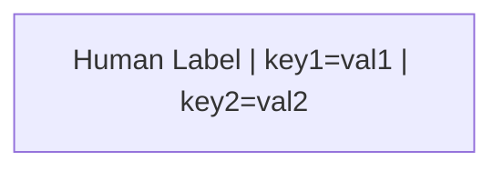
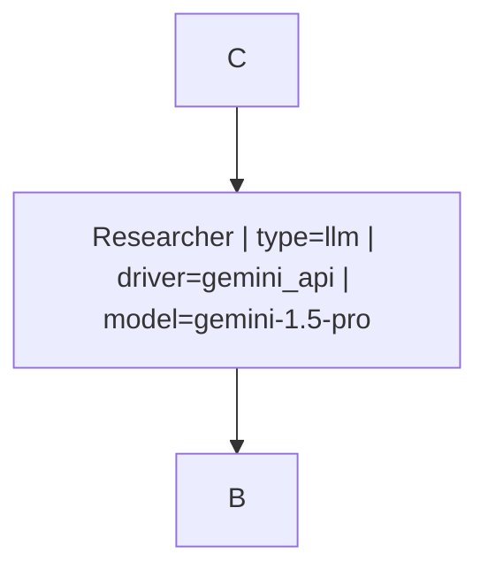
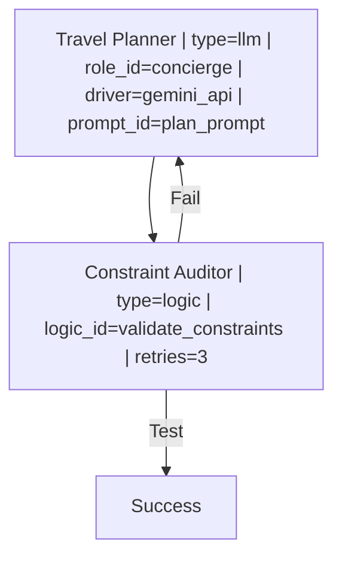
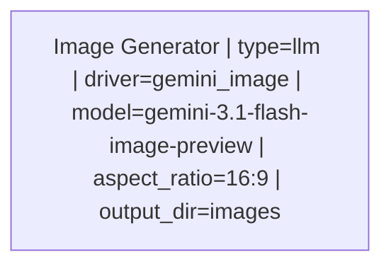

# HydraR Mermaid Orchestration Cheatsheet

This document defines the reserved keywords and syntax for orchestrating HydraR agent networks directly within Mermaid diagrams or YAML workflow definitions.

## Reserved Keywords

To ensure consistent behavior across nodes and drivers, the following keys are reserved when used in the `ID["Label | key=value"]` syntax.

### 1. Node Configuration (`AgentNode`)
| Keyword | Type | Description |
| :--- | :--- | :--- |
| `type` | String | Node specialty: `logic` (default), `llm`, `router`, `map`, `observer`, `merge`, `jules`, `auto`. |
| `retries` | Integer | Number of execution attempts on failure. |
| `timeout` | Integer | Maximum execution time in seconds. |
| `isolation` | Boolean | If `true`, runs in an isolated git worktree. |
| `priority` | Integer | Execution priority for parallel branches (higher = sooner). |
| `checkpoint` | Boolean | If `false`, disables state persistence for this node. |
| `logic_id` | String | ID of the logic/function registered in `HydraR` (required for `type=logic`). |
| `map_key` | String | (For `type=map`) The state key containing the list to map over. |
| `agents_files` | List | Comma-separated paths to markdown files for AI persona injection. |
| `skills_files` | List | Comma-separated paths to markdown files for AI capability injection. |

### 2. LLM / Driver Parameters (`AgentLLMNode`)
| Keyword | Type | Description |
| :--- | :--- | :--- |
| **`driver`** | String | **The primary engine.** See [Available Drivers](#available-drivers) below. |
| `model` | String | LLM model identifier (e.g., `gemini-3.1-flash-lite-preview`). |
| `role` | String | Inline system prompt or persona (e.g., `Expert Researcher`). |
| `role_id` | String | Reference to a registered role in the `roles` registry. |
| `prompt_id` | String | Reference to a registered logic function used to build the prompt. |
| `temp` | Float | Temperature (0.0 to 2.0). |
| `max_tokens`| Integer | Maximum response length. |
| `format` | String | Expected output format (`text`, `json`, `markdown`). |

### 3. Driver-Specific Flags (CLI & Multimodal)
| Keyword | Type | Driver | Description |
| :--- | :--- | :--- | :--- |
| `sandbox` | Boolean | Gemini (CLI) | Enable/disable sandbox execution. |
| `yolo` | Boolean | Gemini (CLI) | Skip safety/confirmation checks. |
| `num_ctx` | Integer | Ollama | Context window size. |
| `verbose` | Boolean | Claude (CLI) | Enable verbose CLI logging. |
| `aspect_ratio`| String | Gemini/OpenAI | Image dimensions (e.g., `1:1`, `16:9`, `4:3`). |
| `image_size` | String | Gemini/OpenAI | Output resolution (e.g., `1K`, `2K`). |
| `output_dir` | String | Logic/Driver | Path to save generated binary assets. |

---

## Available Drivers

The `driver` parameter determines the execution engine for `type=llm` nodes. If omitted, `gemini` (CLI) is the default.

| Shorthand | Class | Provider | Default Model | Mode |
| :--- | :--- | :--- | :--- | :--- |
| `gemini` | `GeminiCLIDriver` | Google | `gemini-2.5-flash` | CLI (Local) |
| `gemini_api`| `GeminiAPIDriver` | Google | `gemini-3.1-flash-lite-preview` | Cloud API |
| `gemini_image`| `GeminiImageDriver`| Google | `gemini-3.1-flash-image-preview` | Multimodal |
| `claude` | `ClaudeCodeDriver` | Anthropic | `claude-3-5-sonnet-latest` | CLI (Local) |
| `openai` | `OpenAIDriver` | OpenAI | `gpt-4o` | Cloud API |
| `ollama` | `OllamaDriver` | Ollama | `llama3.2` | Local (Local) |
| `copilot_cli`| `CopilotCLIDriver` | Github | `copilot` | CLI (Local) |

---

## Mermaid Orchestration Syntax

### Node Definition

### Directives & Types
| Syntax | Interpretation | Example |
| :--- | :--- | :--- |
| `key=3` | Numeric | `retries=3` |
| `key=true` | Logical | `isolation=true` |
| `key=null` | NULL | `model=null` |
| `key=NA` | NA | `temp=NA` |
| `key=val` | String | `role=Analyst` |

### Multi-Line Definitions
For complex nodes, define the parameters in the first occurrence; subsequent occurrences use just the ID.

---

## Orchestration Patterns

### 1. Robust API Planning (Actual Usage)
Based on the `hong_kong_travel.yml` pattern, combining cloud LLMs with deterministic logic gates.

### 2. Node Types & Specializations

*   **`llm`**: Asynchronous model call. Requires `role` or `role_id`.
*   **`logic`**: Executes a registered R function. Requires `logic_id`.
*   **`router`**: Decisions-based branching. Requires `logic_id` that returns a target node ID.
*   **`map`**: Iterates over a list in `state`. Requires `map_key` and `logic_id`.
*   **`merge`**: Harmonizes multiple input branches before proceeding.
*   **`jules`**: Advanced autonomous coding node (Google Jules API).
*   **`auto`**: Fallback; treats the label as a function lookup in the logic registry.

### 3. Resilient Failover (Error Edges)
Standard edges represent the happy path. Error edges define the failover path if a node fails.

| Syntax | Interpretation | Visual |
| :--- | :--- | :--- |
| `A --> B` | Standard Transition | Green/Solid |
| `A -- "Test" --> B` | Success Path (Conditional) | Green/Solid |
| `A -- "Fail" --> C` | Failure Path (Conditional) | Yellow/Solid |
| `A -- "error" --> D` | Failover / Error Path | Red/Dashed |

### 4. Multimodal Image Generation
Use `driver=gemini_image` for generating binary visual assets. Tested with `gemini-3.1-flash-image-preview`.

> [!TIP]
> **Context Injection**: HydraR automatically detects and injects `agents.md` and `skills.md` from your worktree into the system prompt. You can override this using `agents_files=file1,file2`.

> [!IMPORTANT]
> **Deduplication**: If a node is defined multiple times, parameters from the **first** definition containing a pipe `|` are used. Subsequent mentions of the ID inherit these parameters.

<!-- APAF Bioinformatics | Mermaid Orchestration Cheatsheet | Approved | 2026-04-03 -->

