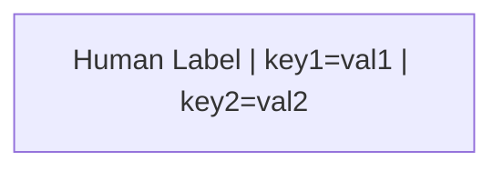
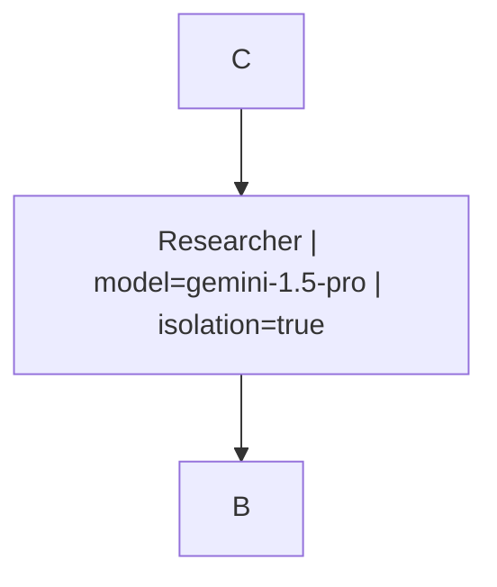
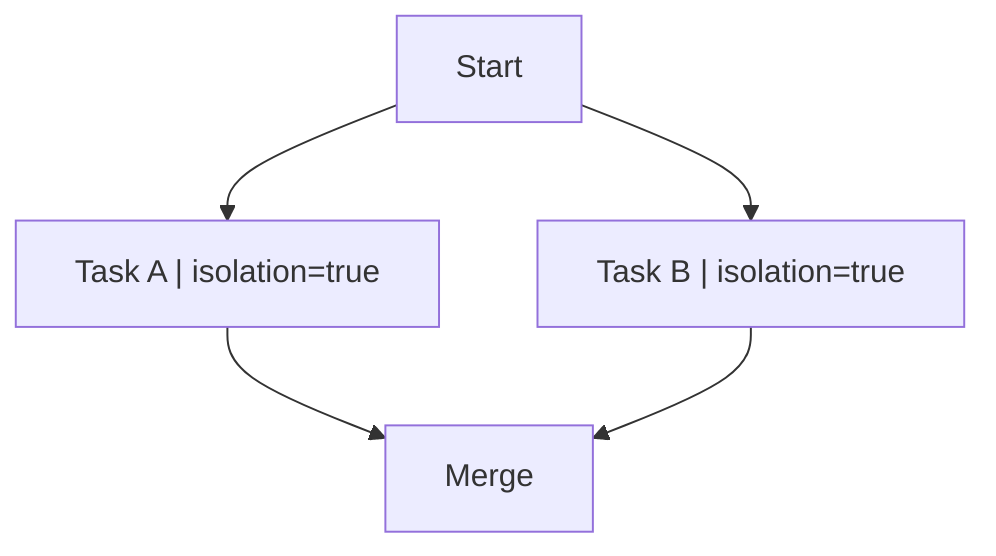
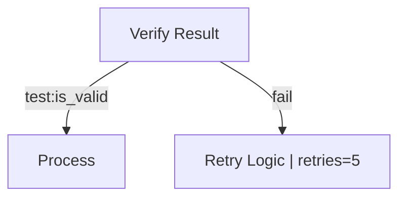

# HydraR Mermaid Orchestration Cheatsheet

This document defines the reserved keywords and syntax for orchestrating HydraR agent networks directly within Mermaid diagrams.

## Reserved Keywords

To ensure consistent behavior across nodes and drivers, the following keys are reserved when used in the `ID["Label | key=value"]` syntax.

### 1. Node Configuration (`AgentNode`)
| Keyword | Type | Description |
| :--- | :--- | :--- |
| `retries` | Integer | Number of execution attempts on failure. |
| `timeout` | Integer | Maximum execution time in seconds. |
| `isolation` | Boolean | If `true`, runs in an isolated git worktree. |
| `priority` | Integer | Execution priority for parallel branches (higher = sooner). |
| `checkpoint` | Boolean | If `false`, disables state persistence for this node. |

### 2. LLM / Driver Parameters (`AgentLLMNode`)
| Keyword | Type | Description |
| :--- | :--- | :--- |
| `model` | String | LLM model identifier (e.g., `gemini-1.5-pro`). |
| `role` | String | System prompt or persona (e.g., `Expert Researcher`). |
| `temp` | Float | Temperature (0.0 to 2.0). |
| `max_tokens`| Integer | Maximum response length. |
| `format` | String | Expected output format (`text`, `json`, `markdown`). |

### 3. CLI Driver Flags (Driver-Specific)
| Keyword | Type | Driver | Description |
| :--- | :--- | :--- | :--- |
| `sandbox` | Boolean | Gemini | Enable/disable sandbox execution. |
| `yolo` | Boolean | Gemini | Skip safety/confirmation checks. |
| `num_ctx` | Integer | Ollama | Context window size. |
| `verbose` | Boolean | Claude | Enable verbose CLI logging. |

---

## Mermaid Orchestration Syntax

### Node Definition

### Directives & Types
| Syntax | Interpretation | Example |
| :--- | :--- | :--- |
| `key=3` | Numeric | `retries=3` |
| `key=true` | Logical | `isolation=true` |
| `key=null` | NULL | `model=null` |
| `key=NA` | NA | `temp=NA` |
| `key=val` | String | `role=Analyst` |

### Multi-Line Definitions
For complex nodes, define the label and parameters in the first occurrence; subsequent occurrences can use just the ID.

---

## Orchestration Patterns

### 1. Parallel Isolation
Use `isolation=true` to trigger parallel git worktree branches.

### 2. Conditional Routing (Conceptual)
Edge labels are preserved but logic must be bound in R.

> [!IMPORTANT]
> **Deduplication**: If a node is defined multiple times with different parameters, HydraR prioritizes the **first** definition containing a pipe `|`.
> **Case Sensitivity**: Reserved keywords are case-sensitive and should be lowercase. values like `true`/`false` are case-insensitive.

<!-- APAF Bioinformatics | HydraR | Approved | 2026-03-29 -->
