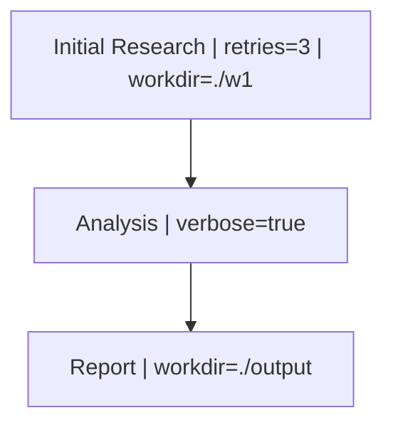

```{r, include = FALSE}
knitr::opts_chunk$set(
  collapse = TRUE,
  comment = "#>",
  eval = TRUE
)
library(HydraR)
```

This vignette demonstrates how to use the `HydraR` Mermaid interpreter to inject parameters directly into nodes using pipe-delimited labels. This allows you to parameterize your graph without modifying any R code.

## Parameter Syntax

In your Mermaid specification, you can include key-value pairs (parameters) within a node's label using the `|` separator. `HydraR`'s `auto_node_factory()` will automatically parse these and make them available to your logic nodes or LLM drivers.



## Loading the Pattern

We define the graph and the logic for our parameterized nodes in a YAML file.

```{r load}
library(HydraR)

# Load the workflow from YAML
wf <- load_workflow("dynamic_dag_patterns.yml")

# Spawn and compile the DAG
dag <- spawn_dag(wf)
```

## Verifying Parameter Injection

Let's inspect the parameters of our nodes. They were parsed directly from the Mermaid graph in the YAML file!

```{r check}
# Access parameters parsed from the labels
print(dag$nodes$A$params)
print(dag$nodes$B$params)
```

## Running the DAG

When the nodes execute, our logic function can access these parameters using the `params` argument provided to the logic node's function.

```{r run}
# Run the DAG
final <- dag$run(wf$initial_state)
```

## Round-Trip Visualization

You can use the `plot(details = TRUE)` method to export your DAG back to Mermaid with the parameters preserved. This is excellent for debugging complex configurations.

```{r plot}
# Show all parameters in the Mermaid plot
dag$plot(details = TRUE)

# Filter to specific parameters (useful for high-density graphs)
dag$plot(details = TRUE, include_params = "retries")
```

---
<!-- APAF Bioinformatics | dynamic_dag_patterns.Rmd | Approved | 2026-04-03 -->
