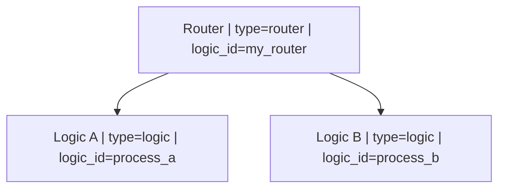
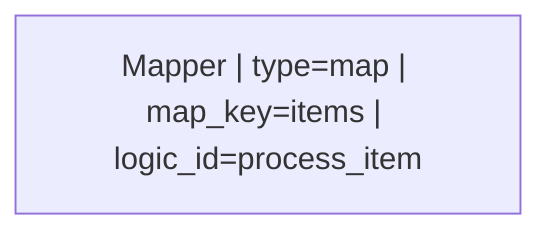
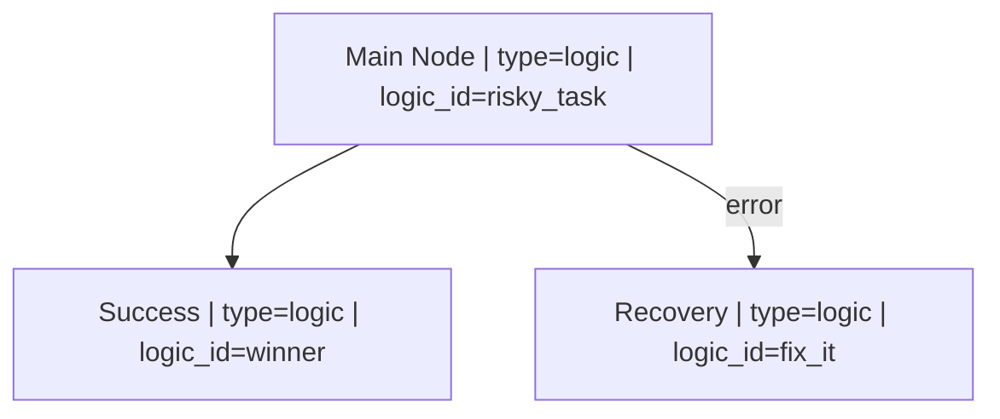

```{r, include = FALSE}
knitr::opts_chunk$set(
  collapse = TRUE,
  comment = "#>"
)
```

```{r setup}
library(HydraR)
```

# Introduction

HydraR supports complex "Network Logic Circuitry" that goes beyond simple Directed Acyclic Graphs. This includes dynamic routing, mapping over lists, and robust error handling via specialized nodes and edges.

## 1. Dynamic Routing (The Switch Node)

An `AgentRouterNode` uses logic (R or LLM) to decide which node to visit next at runtime.



```r
# Register router logic
register_logic("my_router", function(state) {
  if (state$get("mode") == "fast") {
    return(list(target_node = "NodeA", output = "Fast mode selected"))
  } else {
    return(list(target_node = "NodeB", output = "Safe mode selected"))
  }
})
```

## 2. Iterative Mapping (The Map Node)

The `AgentMapNode` allows you to iterate over a list in the state and perform an operation for each item. By default, it uses `purrr::map` for sequential execution.



```r
register_logic("process_item", function(item, state) {
  # Perform operation on item
  list(status = "success", output = paste("Processed", item))
})
```

## 3. Self-Healing Networks (Error Edges)

Error edges allow you to define failover logic. If a node returns a `failed` status, the DAG will follow the error edge instead of the standard path.



```yml
# workflow.yml
graph: |
  graph TD
    Main["Main | type=logic | logic_id=risky"]
    Recover["Recover | type=logic | logic_id=fix"]
    Main --> Success
error_edges:
  Main: Recover
```

# Conclusion

By combining these advanced components, you can build highly resilient and adaptive multi-agent systems that handle complex real-world logic.

---
<!-- APAF Bioinformatics | HydraR | Approved | 2026-03-31 -->
