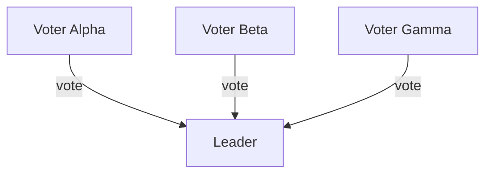

```{r, include = FALSE}
knitr::opts_chunk$set(
  collapse = TRUE,
  comment = "#>",
  eval = TRUE
)
library(HydraR)
```

This vignette demonstrates how to use the `HydraR` messaging API to simulate a **Distributed Consensus** algorithm. In this scenario, multiple "Voter" agents independently decide on a value and send their decision to a "Leader" agent, who determines the final outcome based on a majority.

## Architecture

Communication in `HydraR` is handled through a `RestrictedState` wrapper, which provides each node with a private inbox. This ensures that nodes can only see messages explicitly sent to them.



## Setup
```{r, eval = FALSE}
# install.packages("devtools") # Run if devtools is not installed
devtools::install_github("APAF-bioinformatics/HydraR")

# install.packages("pak")
pak::pak("APAF-bioinformatics/HydraR")

devtools::load_all() # Quickly loads all local changes into your session
```

First, we load the `HydraR` package and initialize a `MemoryMessageLog` to audit our simulation.

```{r setup_consensus}
library(HydraR)

# Initialize a persistent, parallel-safe audit log
log_path <- file.path(tempdir(), "consensus_msgs.jsonl")
message_log <- JSONLMessageLog$new(path = log_path)
```

## Defining the Workflow Components

To keep our architecture clean, we store the deterministic logic for both Voters and the Leader in a central registry.

```{r logic_registry}
consensus_logic_registry <- list(
  # 1. Deterministic Logic Functions
  logic = list(
    Voter = function(state, params = NULL) {
      # 1. Decide randomly
      vote <- sample(c("SUCCESS", "FAILURE"), 1)

      # 2. Send private message to the Leader
      state$send_message(to = "Leader", content = list(vote = vote))

      message(sprintf("   [%s] Voted: %s", state$node_id, vote))
      list(status = "SUCCESS", output = vote)
    },
    Leader = function(state, params = NULL) {
      # 1. Retrieve messages from private inbox
      msgs <- state$receive_messages()

      if (length(msgs) == 0) {
        return(list(status = "FAILED", output = "nothing to tabulate"))
      }

      # 2. Extract and count votes
      votes <- sapply(msgs, function(m) m$content$vote)
      counts <- table(votes)

      # 3. Determine majority
      majority <- names(counts)[which.max(counts)]

      message(sprintf("   [Leader] Received %d votes. Consensus: %s", length(votes), majority))
      list(status = "SUCCESS", output = list(final_consensus = majority, vote_table = as.list(counts)))
    }
  )
)
```

## The Node Factory

We use a factory function to dynamically resolve nodes. In this case, we use a generic `Voter` logic for multiple independent nodes (`V1`, `V2`, `V3`).

```{r factory}
consensus_node_factory <- function(id, label, params) {
  # Map V1, V2, V3 to the generic Voter logic
  logic_key <- if (grepl("^V", id)) "Voter" else id

  AgentLogicNode$new(
    id = id,
    label = label,
    logic_fn = consensus_logic_registry$logic[[logic_key]]
  )
}
```

## Building the DAG via Mermaid

We define the entire workflow architecture as a Mermaid string. This string serves as the single source of truth for both structure and node metadata.

```{r mermaid_source}
mermaid_graph <- "
graph TD
  V1[Voter Alpha] --> Leader
  V2[Voter Beta] --> Leader
  V3[Voter Gamma] --> Leader
  Leader[Consensus Leader]
"

# Instantiate the DAG
dag <- AgentDAG$from_mermaid(mermaid_graph, node_factory = consensus_node_factory)
dag$message_log <- message_log # Attach the audit log
compiled_dag <- dag$compile()
```

## Building and Running the Simulation

We assemble the nodes into an `AgentDAG`. The `Leader` depends on all three `Voters`.

```{r execution, eval = FALSE}
# Execute the consensus run
final_run <- compiled_dag$run(initial_state = list(topic = "simulation"))

# View final result from the Leader
print(final_run$results$Leader$output$final_consensus)
print(final_run$results$Leader$output$vote_table)
```

## Auditing the Communication

Since we attached a `MemoryMessageLog`, we can inspect the raw message transfers that occurred during the simulation.

```{r audit, eval = FALSE}
# Retrieve all recorded messages from the audit log
all_msgs <- message_log$get_all()

# Format as a table using purrr for robustness
msg_history <- purrr::map(all_msgs, function(m) {
  data.frame(
    From = m$from,
    To = m$to,
    Time = format(m$timestamp, "%H:%M:%S"),
    Vote = m$content$vote
  )
}) |> purrr::list_rbind()

print(msg_history)
```

## Visualization

The `plot()` method shows the final status of our consensus engine.

```{r plot, eval = FALSE}
cat(dag$plot(status = TRUE))
```


```{r plot_interactive, eval = FALSE}
library(DiagrammeR)
# Get the mermaid syntax from the DAG
mermaid_string <- dag$plot(status = TRUE)
# Render the interactive plot
DiagrammeR::mermaid(mermaid_string)
```

<!-- APAF Bioinformatics | distributed_communication.Rmd | Approved | 2026-03-29 -->
