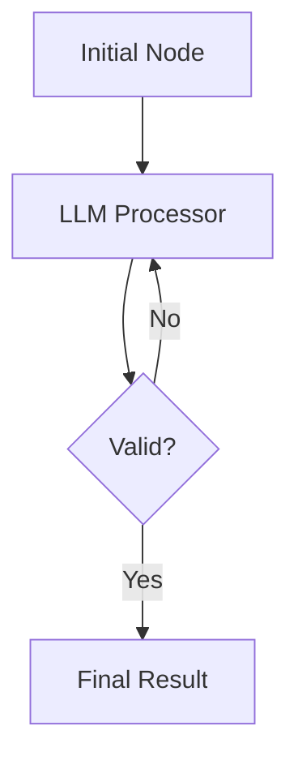

```{r setup, include = FALSE}
knitr::opts_chunk$set(
  collapse = TRUE,
  comment = "#>"
)
```

## 1. Introduction

`HydraR` is a professional-grade agentic orchestration framework built for R. It enables the design, execution, and monitoring of complex multi-agent workflows using a Directed Acyclic Graph (DAG) architecture that supports **iterative loops**, **parallel execution**, and **persistent state**.

Developed at **APAF Bioinformatics**, `HydraR` addresses the need for durable, CLI-first agentic systems that can operate reliably in scientific and software engineering environments.

## 2. Core Architecture

The framework is built around four primary R6 classes:

1.  **`AgentDAG`**: The central orchestrator that manages nodes, edges, and execution flow. Usually instantiated via `AgentDAG$from_mermaid()`.
2.  **`AgentNode`**: The fundamental unit of work, typically resolved via a **Node Factory**.
    -   **`AgentLLMNode`**: Interfaces with Large Language Models via Drivers.
    -   **`AgentLogicNode`**: Executes deterministic R functions from a **Logic Registry**.
3.  **`AgentState`**: A structured, centrally managed container for all data shared between nodes.
4.  **`AgentDriver`**: A provider-agnostic interface for communicating with LLMs (e.g., `GeminiCLIDriver`).

---

## 3. Getting Started

### Installation

```r
# install.packages("devtools")
devtools::install_github("apaf-bioinformatics/HydraR")
```

### Your First DAG

The recommended way to build a DAG in `HydraR` is using the **Mermaid-as-Source** pattern. This involves defining a visual graph and a "registry" of logic.

```r
library(HydraR)

# 1. Define a logic registry
logic_registry <- list(
  logic = list(
    Hello = function(state, params = NULL) {
      name <- state$get("user_name", "Stranger")
      list(status = "SUCCESS", output = list(greeting = paste("Hello,", name)))
    }
  )
)

# 2. Define a node factory
node_factory <- function(id, label, params) {
  AgentLogicNode$new(id = id, label = label, logic_fn = logic_registry$logic[[id]])
}

# 3. Build from Mermaid and run
mermaid_graph <- "graph TD; Hello[Greet User]"
dag <- AgentDAG$from_mermaid(mermaid_graph, node_factory = node_factory)

result <- dag$compile()$run(initial_state = list(user_name = "Hydra User"))
print(result$state$get("greeting"))
#> [1] "Hello, Hydra User"
```

---

## 4. Advanced Orchestration

### Iterative Loops

`HydraR` supports **conditional edges** defined in the Mermaid graph or added programmatically. This enables complex "self-healing" behaviors.

```r
# In your Mermaid graph:
# Reviewer -- Needs Revision --> Writer

# Add the logic for the transition
dag$add_conditional_edge(
  from = "Reviewer",
  test = function(out) isTRUE(out$valid),
  if_true = NULL,         # End execution
  if_false = "Writer"     # Loop back
)
```

### Parallel Execution & Worktrees

By integrating with the `furrr` package and **Git Worktrees**, `HydraR` can execute independent branches of your DAG in parallel isolated environments.

```r
# Run the DAG with worktree isolation enabled
result <- dag$run(
  initial_state = init,
  use_worktrees = TRUE,
  repo_root = getwd() # Current repository
)
```

---

## 5. State Management & Reducers

`AgentState` ensures that all agents have a consistent view of the world. You can use **Reducers** to control how state is updated when multiple nodes modify the same variable.

```r
state <- AgentState$new(
  initial_data = list(logs = list()),
  reducers = list(logs = reducer_append)
)

# Any node updating 'logs' will now append to the existing list 
# instead of overwriting it.
```

---

## 6. Persistence & Resilience

For long-running workflows, `HydraR` provides a **Checkpointer** system. If an execution is interrupted, it can be resumed from the last successful node using a unique `thread_id`.

Supported backends:
- **`MemorySaver`**: In-memory storage (default).
- **`RDSSaver`**: File-based storage.
- **`DuckDBSaver`**: High-performance persistent database.

```r
saver <- DuckDBSaver$new(db_path = "history.duckdb")
result <- dag$run(
  initial_state = init,
  checkpointer = saver,
  thread_id = "research-session-001"
)
```

---

## 7. Working with LLMs

`HydraR` is driver-agnostic. Use the **Node Factory** to resolve drivers based on parameters embedded in your Mermaid labels.

```r
# Mermaid: Consultant[Expert | driver=gemini]

node_factory <- function(id, label, params) {
  driver_obj <- if (isTRUE(params[["driver"]] == "gemini")) GeminiCLIDriver$new() else NULL
  
  AgentLLMNode$new(
    id = id,
    label = label,
    driver = driver_obj,
    role = "Expert Consultant",
    prompt_builder = function(state) sprintf("Analyze: %s", state$get("problem"))
  )
}
```

---

## 8. Visualization

`HydraR` generates high-quality **Mermaid.js** diagrams that can be rendered in RStudio, GitHub, or `pkgdown`.

```r
# Generate a status-aware plot after execution
# Success = Green, Error = Red, Active Path = High density
cat(dag$plot(status = TRUE))
```



---

## 9. Integration with `targets`

Treat an entire `AgentDAG` execution as a unique, cached target within your analytical pipeline.

```r
# _targets.R
list(
  tar_target(
    agent_report,
    {
      mermaid_graph <- "graph TD; A[Analysis] --> B[Summary]"
      dag <- AgentDAG$from_mermaid(mermaid_graph, node_factory = my_factory)
      dag$compile()$run(initial_state = list(input = data))$state$get_all()
    },
    format = "rds"
  )
)
```

---

## 10. Conclusion

`HydraR` provides the scaffolding needed to turn isolated LLM calls into robust, stateful, and observable agentic systems. By combining R's analytical power with modern LLM orchestration, it empowers bioinformatics and data science teams to build the next generation of intelligent tools.

For more detailed examples, refer to the [Case Studies](articles/hong_kong_travel.html).

---
<!-- APAF Bioinformatics | manual.Rmd | Approved | 2026-03-29 -->
