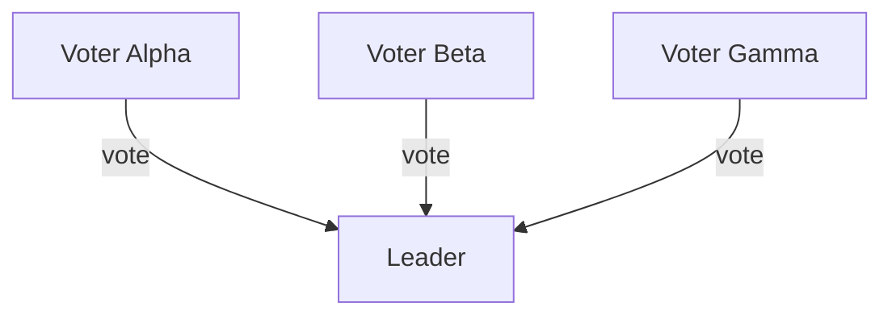

```{r, include = FALSE}
knitr::opts_chunk$set(
  collapse = TRUE,
  comment = "#>",
  eval = TRUE
)
```

This vignette demonstrates how to use the `HydraR` messaging API to simulate a **Distributed Consensus** algorithm. In this scenario, multiple "Voter" agents independently decide on a value and send their decision to a "Leader" agent, who determines the final outcome based on a majority.

## Architecture

Communication in `HydraR` is handled through a `RestrictedState` wrapper, which provides each node with a private inbox. This ensures that nodes can only see messages explicitly sent to them.



## Setup
```{r, eval = FALSE}
# install.packages("devtools") # Run if devtools is not installed
devtools::install_github("APAF-bioinformatics/HydraR")

# install.packages("pak")
pak::pak("APAF-bioinformatics/HydraR")

devtools::load_all() # Quickly loads all local changes into your session
```

First, we load the `HydraR` package and initialize a `MemoryMessageLog` to audit our simulation.

```{r setup}
library(HydraR)

# Initialize an audit log for our messages
message_log <- MemoryMessageLog$new()
```

## Defining the Voter Agents

Voters are `AgentLogicNode` instances that randomly decide between "SUCCESS" and "FAILURE", then send their choice to the `Leader`.

```{r voters}
# A reusable logic function for voters
voter_logic <- function(state) {
  # 1. Decide randomly
  vote <- sample(c("SUCCESS", "FAILURE"), 1)

  # 2. Send private message to the Leader
  state$send_message(to = "Leader", content = list(vote = vote))

  message(sprintf("   [%s] Voted: %s", state$node_id, vote))
  list(status = "success", output = vote)
}

# Create three independent voter nodes
node_v1 <- AgentLogicNode$new("V1", voter_logic, label = "Voter Alpha")
node_v2 <- AgentLogicNode$new("V2", voter_logic, label = "Voter Beta")
node_v3 <- AgentLogicNode$new("V3", voter_logic, label = "Voter Gamma")
```

## Defining the Leader Agent

The Leader is a `AgentLogicNode` that waits for all messages, counts the votes, and declares a final consensus.

```{r leader}
leader_logic <- function(state) {
  # 1. Retrieve messages from private inbox
  msgs <- state$receive_messages()

  # 2. Extract and count votes
  votes <- sapply(msgs, function(m) m$content$vote)
  counts <- table(votes)

  # 3. Determine majority
  majority <- names(counts)[which.max(counts)]

  message(sprintf("   [Leader] Received %d votes. Consensus: %s", length(votes), majority))
  list(status = "success", output = list(final_consensus = majority, vote_table = as.list(counts)))
}

node_leader <- AgentLogicNode$new("Leader", leader_logic, label = "Consensus Leader")
```

## Building and Running the Simulation

We assemble the nodes into an `AgentDAG`. The `Leader` depends on all three `Voters`.

```{r execution}
# Create the DAG
dag <- AgentDAG$new()
dag$message_log <- message_log # Attach the audit log

dag$add_node(node_v1)
dag$add_node(node_v2)
dag$add_node(node_v3)
dag$add_node(node_leader)

# Standard DAG dependency: Leader runs after all voters finish
dag$add_edge(from = c("V1", "V2", "V3"), to = "Leader")

dag$compile()

# Execute the consensus run
final_run <- dag$run(initial_state = list(topic = "simulation"))

# View final result from the Leader
print(final_run$results$Leader$output$final_consensus)
print(final_run$results$Leader$output$vote_table)
```

## Auditing the Communication

Since we attached a `MemoryMessageLog`, we can inspect the raw message transfers that occurred during the simulation.

```{r audit}
# Retrieve all recorded messages from the audit log
all_msgs <- message_log$get_all()

# Format as a table using purrr for robustness
msg_history <- purrr::map(all_msgs, function(m) {
  data.frame(
    From = m$from,
    To = m$to,
    Time = format(m$timestamp, "%H:%M:%S"),
    Vote = m$content$vote
  )
}) |> purrr::list_rbind()

print(msg_history)
```

## Visualization

The `plot()` method shows the final status of our consensus engine.

```{r plot}
cat(dag$plot(status = TRUE))
```


```{r plot_interactive, eval = requireNamespace("DiagrammeR", quietly = TRUE)}
library(DiagrammeR)
# Get the mermaid syntax from the DAG
mermaid_string <- dag$plot(status = TRUE)
# Render the interactive plot
DiagrammeR::mermaid(mermaid_string)
```

<!-- APAF Bioinformatics | distributed_communication.Rmd | Approved | 2026-03-29 -->
