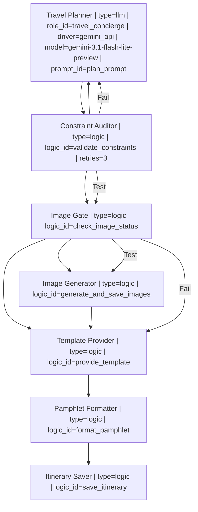

``` r
# Toggle for slow/expensive and potentially rate-limited AI figure generation
# Set to TRUE to force-regenerate the images, otherwise uses existing ones.
FORCE_REGENERATE_IMAGES <- FALSE
ASPECT_RATIO <- "16:9"


## If you want to regenerate the images, you'll need to turn FORCE_REGENERATE_IMAGES to TRUE
## and also set the GEMINI_API_KEY environment variable in .Renviron file.
```


## Introduction

This vignette demonstrates the **Zero-R-Code** orchestration pattern using `HydraR`. Instead of defining roles, logic, and state in R blocks, we define the entire workflow in a single `workflow.yml` file.

The R environment acts purely as an **interpreter/compiler** for the language-independent manifest.

## Setup

First, load the HydraR library.


``` r
library(HydraR)
```

## Loading the Workflow (Declarative YAML)

We use `load_workflow()` to ingest the entire definition from `hong_kong_travel.yml`. This file contains the:
1. **Mermaid Graph** (Source of truth for DAG architecture)
2. **LLM Roles** (System prompts for travel concierges)
3. **Anonymous Logic** (R snippets for constraints and prompting)
4. **Initial State** (Pre-configurations for the journey)


``` r
# Load everything from the external declarative source
wf <- load_workflow("hong_kong_travel.yml")
```

## Instantiating the DAG

With the registries populated by the loader, we simply pass the graph and the universal `auto_node_factory()` to `mermaid_to_dag()`.


``` r
dag <- spawn_dag(wf, auto_node_factory())
#> [HydraR Warning] Logic 'plan_prompt': 'state' object is not referenced. Ensure your logic interacts with the AgentState.
#> [HydraR Warning] Logic 'plan_prompt' [Lint]: Put spaces around all infix operators. (line 1)
#> [HydraR Warning] Logic 'image_prompt': 'state' object is not referenced. Ensure your logic interacts with the AgentState.
#> [HydraR Warning] Logic 'image_prompt' [Lint]: Put spaces around all infix operators. (line 1)
#> [HydraR Warning] Logic 'validate_constraints': 'state' object is not referenced. Ensure your logic interacts with the AgentState.
#> [HydraR Warning] Logic 'validate_constraints' [Lint]: Put spaces around all infix operators. (line 1)
#> [HydraR Warning] Logic 'check_image_status': 'state' object is not referenced. Ensure your logic interacts with the AgentState.
#> [HydraR Warning] Logic 'check_image_status' [Lint]: Put spaces around all infix operators. (line 1)
#> [HydraR Warning] Logic 'generate_and_save_images': 'state' object is not referenced. Ensure your logic interacts with the AgentState.
#> [HydraR Warning] Logic 'generate_and_save_images' [Lint]: Put spaces around all infix operators. (line 1)
#> [HydraR Warning] Logic 'provide_template': 'state' object is not referenced. Ensure your logic interacts with the AgentState.
#> [HydraR Warning] Logic 'provide_template' [Lint]: Put spaces around all infix operators. (line 1)
#> [HydraR Warning] Logic 'format_pamphlet': 'state' object is not referenced. Ensure your logic interacts with the AgentState.
#> [HydraR Warning] Logic 'format_pamphlet' [Lint]: Put spaces around all infix operators. (line 1)
#> [HydraR Warning] Logic 'save_itinerary': 'state' object is not referenced. Ensure your logic interacts with the AgentState.
#> [HydraR Warning] Logic 'save_itinerary' [Lint]: Put spaces around all infix operators. (line 1)
#> Warning in dag$compile(): Potential infinite loop detected: graph contains
#> cycles. Ensure conditional edges have exit conditions.
#> Graph compiled successfully.
```

## Visualizing the Workflow

We can view the agent's logic directly using Mermaid.js syntax.


```` r
cat("```mermaid\n")
````

```mermaid

``` r
cat(dag$plot(type = "mermaid", details = TRUE))
```




```` r
cat("\n```\n")
````

```

## Execution

When we run the DAG, we use the `initial_state` extracted from the YAML file. No manual R list creation is required.


``` r
# Register a checkpointer for durability
checkpointer <- DuckDBSaver$new(db_path = "travel_booking.duckdb")

# Run the orchestration using the state from YAML
results <- dag$run(
  initial_state = append(wf$initial_state, list(
    force_regenerate_images = FORCE_REGENERATE_IMAGES,
    aspect_ratio = ASPECT_RATIO
  )),
  max_steps = 15,
  checkpointer = checkpointer
)
#> Warning in self$compile(): Potential infinite loop detected: graph contains
#> cycles. Ensure conditional edges have exit conditions.
#> Graph compiled successfully.
#> [2026-04-05 09:38:18] [DEBUG] Queue: Planner | Running: Planner
#> DEBUG: [gemini_api] Calling URL: https://generativelanguage.googleapis.com/v1beta/models/gemini-3.1-flash-lite-preview:generateContent
#> [2026-04-05 09:38:26] [DEBUG] Queue: Validator | Running: Validator
#>    [Validator] Executing R logic...
#> [2026-04-05 09:38:26] [DEBUG] Queue: Planner | Running: Planner
#> DEBUG: [gemini_api] Calling URL: https://generativelanguage.googleapis.com/v1beta/models/gemini-3.1-flash-lite-preview:generateContent
#> [2026-04-05 09:38:31] [DEBUG] Queue: Validator | Running: Validator
#>    [Validator] Executing R logic...
#> [2026-04-05 09:38:31] [DEBUG] Queue: Planner | Running: Planner
#> DEBUG: [gemini_api] Calling URL: https://generativelanguage.googleapis.com/v1beta/models/gemini-3.1-flash-lite-preview:generateContent
#> [2026-04-05 09:38:39] [DEBUG] Queue: Validator | Running: Validator
#>    [Validator] Executing R logic...
#> [2026-04-05 09:38:39] [DEBUG] Queue: Planner | Running: Planner
#> DEBUG: [gemini_api] Calling URL: https://generativelanguage.googleapis.com/v1beta/models/gemini-3.1-flash-lite-preview:generateContent
#> [2026-04-05 09:38:47] [DEBUG] Queue: Validator | Running: Validator
#>    [Validator] Executing R logic...
#> [2026-04-05 09:38:47] [DEBUG] Queue: Planner | Running: Planner
#> DEBUG: [gemini_api] Calling URL: https://generativelanguage.googleapis.com/v1beta/models/gemini-3.1-flash-lite-preview:generateContent
#> [2026-04-05 09:38:55] [DEBUG] Queue: Validator | Running: Validator
#>    [Validator] Executing R logic...
#> [2026-04-05 09:38:55] [DEBUG] Queue: Planner | Running: Planner
#> DEBUG: [gemini_api] Calling URL: https://generativelanguage.googleapis.com/v1beta/models/gemini-3.1-flash-lite-preview:generateContent
#> [2026-04-05 09:39:03] [DEBUG] Queue: Validator | Running: Validator
#>    [Validator] Executing R logic...
#> [2026-04-05 09:39:03] [DEBUG] Queue: Planner | Running: Planner
#> DEBUG: [gemini_api] Calling URL: https://generativelanguage.googleapis.com/v1beta/models/gemini-3.1-flash-lite-preview:generateContent
#> [2026-04-05 09:39:08] [DEBUG] Queue: Validator | Running: Validator
#>    [Validator] Executing R logic...
#> [2026-04-05 09:39:08] [DEBUG] Queue: Planner | Running: Planner
#> DEBUG: [gemini_api] Calling URL: https://generativelanguage.googleapis.com/v1beta/models/gemini-3.1-flash-lite-preview:generateContent
#> Warning in self$.run_iterative(max_steps, checkpointer, thread_id, resume_from,
#> : Reached max_steps.

# Display final itinerary
cat("\n\n### Generated Itinerary\n")
#> 
#> 
#> ### Generated Itinerary
cat(as.character(results$state$get("Planner")))
#> Hello! As your travel concierge, I am delighted to curate this itinerary for your Hong Kong escape. Travelling on Qantas (likely the direct SYD-HKG overnight flight), you will arrive refreshed and ready to experience the vibrant pulse of the city.
#> 
#> ### **Flight Summary (Proposed)**
#> *   **Departure:** May 26, 2026 – QF127 (Sydney to Hong Kong)
#> *   **Return:** June 1, 2026 – QF128 (Hong Kong to Sydney)
#> 
#> ---
#> 
#> ### **Itinerary: May 26 – June 1, 2026**
#> 
#> #### **Day 1: Arrival & The Harbor Glow (May 27)**
#> *   **Morning:** Arrive at HKIA. Take the Airport Express to Central/Kowloon. Drop bags at your hotel.
#> *   **Afternoon:** Head to the **Tsim Sha Tsui Promenade**. Walk the Avenue of Stars for the classic skyline view.
#> *   **Evening:** Enjoy a welcome dinner at a local **Cha Chaan Teng** (Hong Kong-style tea restaurant) like *Lan Fong Yuen* to get an authentic taste of HK milk tea and pork chop buns.
#> *   **Night:** Watch the "Symphony of Lights" at 8:00 PM.
#> 
#> #### **Day 2: Cultural Exploration & Comfort Food (May 28)**
#> *   **Morning:** Take the Mid-Levels Escalator up to the **Man Mo Temple** in Sheung Wan.
#> *   **Lunch:** Visit **The Spaghetti House** (Tsim Sha Tsui or Causeway Bay branch) for a nostalgic lunch. Their "HK-Western" fusion style is a unique local staple.
#> *   **Afternoon:** Wander through the antique shops on Hollywood Road and the PMQ creative hub.
#> *   **Evening:** Dim Sum dinner at *Tim Ho Wan* or *Luk Yu Tea House*.
#> 
#> #### **Day 3: The Island Escape – Cheung Chau (May 29)**
#> *   **Morning:** Head to Central Pier 5. Catch the "Fast Ferry" (approx. 35 mins) to **Cheung Chau Island**.
#> *   **Activities:** 
#>     *   Rent a bicycle to tour the island. 
#>     *   Visit the **Pak Tai Temple**. 
#>     *   Walk the "Mini Great Wall" hiking trail for coastal views. 
#>     *   Stop at **Cheung Po Tsai Cave**.
#> *   **Lunch:** Enjoy fresh local seafood at one of the open-air restaurants along the Cheung Chau Praya. Don’t leave without trying the famous **"Mango Mochi."**
#> *   **Evening:** Return to HK Island and enjoy a quiet dinner in Soho.
#> 
#> #### **Day 4: Peaks and Markets (May 30)**
#> *   **Morning:** Take the **Peak Tram** to Victoria Peak. Walk the Lugard Road circular path for the best photos.
#> *   **Lunch:** Casual dim sum or noodles at *Mak’s Noodle* (famous for wonton soup).
#> *   **Afternoon:** Head to Mong Kok. Explore the **Goldfish Market**, **Ladies Market**, and **Fa Yuen Street (Sneaker Street)**.
#> *   **Dinner:** Dive into local street food—try curry fish balls, stinky tofu (if you're brave!), and egg waffles (*gai daan jai*).
#> 
#> #### **Day 5: Heritage & Harbor Crossings (May 31)**
#> *   **Morning:** Take the **Star Ferry** from Central to Tsim Sha Tsui (the most scenic $0.50 trip in the world).
#> *   **Afternoon:** Visit the **Hong Kong Museum of History** to understand the city's unique evolution.
#> *   **Dinner:** A final, grand Cantonese banquet at *Maxim’s Palace* (City Hall) to experience traditional push-cart dim sum overlooking the harbor.
#> 
#> #### **Day 6: Departure (June 1)**
#> *   **Morning:** A final stroll through Hong Kong Park and the Edward Youde Aviary.
#> *   **Lunch:** One last meal at a local congee shop—*Sang Kee Congee* in Sheung Wan is excellent for a hearty, comforting breakfast/lunch.
#> *   **Afternoon:** Head to the airport via Airport Express for your Qantas flight home.
#> 
#> ---
#> 
#> ### **Concierge Tips for Your Trip:**
#> 1.  **Transport:** Purchase an **Octopus Card** immediately upon arrival at the airport. It is essential for MTR, ferries, trams, and even convenience store purchases.
#> 2.  **Dining:** The Spaghetti House is a local chain that offers a familiar, comforting atmosphere—perfect for a relaxed lunch during a busy day of sightseeing.
#> 3.  **Weather:** Early June in Hong Kong is warm and humid. Pack light, breathable fabrics and an umbrella for the occasional tropical shower.
#> 4.  **Booking:** For *Maxim’s Palace*, ensure you arrive early or have your hotel concierge make a reservation, as it is very popular with both locals and tourists. 
#> 
#> **Safe travels! Let me know if you would like me to adjust any activities or restaurant preferences.**

# Display Constraint Audit Report
cat("\n\n### Constraint Audit Report\n")
#> 
#> 
#> ### Constraint Audit Report
report <- results$state$get("report")
if (!is.null(report)) {
  cat(as.character(report))
} else {
  cat("No audit report available.")
}
#> ### Constraint Audit Report
#> Date: 2026-04-05 09:39:08.884536
#> - [x] Cheung Chau Island
#> - [x] Spaghetti House
#> - [ ] Local Cuisine

# Display Pamphlet (HTML)
cat("\n\n### Formatted Pamphlet (HTML Fragment)\n")
#> 
#> 
#> ### Formatted Pamphlet (HTML Fragment)
pamphlet_html <- results$state$get("PamphletFormatter")
if (!is.null(pamphlet_html)) {
  htmltools::HTML(pamphlet_html)
} else {
  cat("Pamphlet not generated.")
}
#> Pamphlet not generated.

# List Artifacts
cat("\n\n### Generated Artifacts\n")
#> 
#> 
#> ### Generated Artifacts
artifacts <- list.files(pattern = "hong_kong|validation_report")
if (length(artifacts) > 0) {
  cat(paste("- ", artifacts, collapse = "\n"))
} else {
  cat("No artifacts found.")
}
#> -  hong_kong_pamphlet.html
#> -  hong_kong_travel.Rmd
#> -  hong_kong_travel.Rmd.orig
#> -  hong_kong_travel.yml
```

## Conclusion

This workflow demonstrates how `HydraR` enables **Truly Zero-R-Code** definitions:
1. **Language-Independent**: The workflow is defined in YAML and Mermaid, making it portable.
2. **Reduced Boilerplate**: `load_workflow()` handles all registration and state parsing.
3. **Maintainable**: Logic and roles are separated from the R execution engine.

---
<!-- APAF Bioinformatics | hong_kong_travel.Rmd | Approved | 2026-03-30 -->
