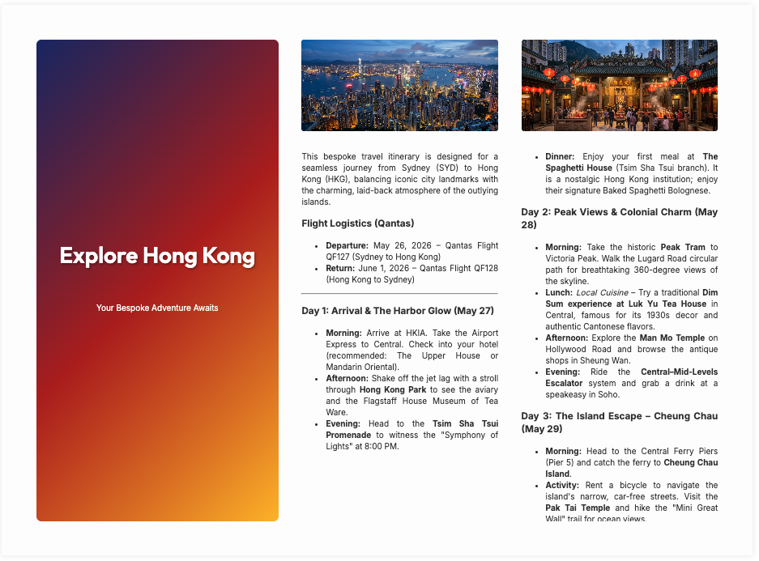
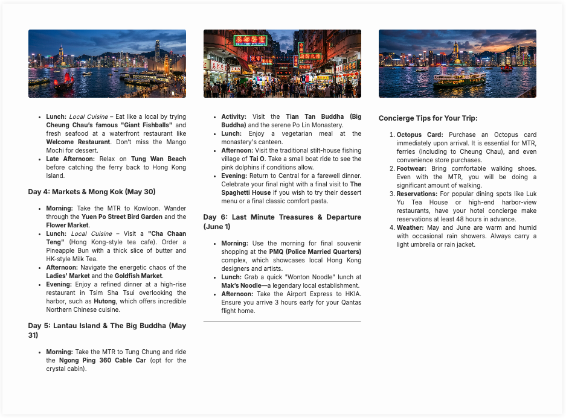

# Case Study: Multimodal Travel Itinerary Planner

This case study demonstrates the **Zero-R-Code** orchestration pattern using YAML and Mermaid.js. It features a complex workflow with iterative validation loops and parallel generation paths.

## Overview

In this example, an LLM **Planner** agent generates a draft itinerary, which is then audited by a deterministic **Validator** against hard research or travel constraints. Successfully validated plans proceed to a *multimodal image generation* phase where **Gemini 1.5 Flash** creates visual assets based on the itinerary's locales. Finally, a logic node renders a bespoke, CSS-styled HTML pamphlet. 

Crucially, **conditional looping** between the planner and validator enforces an iterative refinement cycle until all strict parameters are met.

| Travel Pamphlet Page 1 | Travel Pamphlet Page 2 |
|:---:|:---:|
|  |  |
*Figure 1: Multi-modal travel itinerary planner results showing generated visual content and final formatted itinerary.*

## Workflow Structure

The workflow is defined declaratively using YAML. The `AgentDAG` manages the state transitions and parallel execution of image generation and template preparation.


*Figure 2: Visual DAG structure of the travel planner, featuring iterative validation loops.*

### Declarative Workflow (YAML)

```yaml
graph: |
  graph LR
    Planner["Travel Planner | type=llm | role_id=travel_concierge"]
    Validator["Constraint Auditor | type=logic | logic_id=validate_constraints"]
    ImageGate["Image Gate | type=logic | logic_id=check_image_status"]
    ImageGenerator["Image Generator | type=logic | logic_id=generate_and_save_images"]
    TemplateManager["Template Provider | type=logic | logic_id=provide_template"]
    PamphletFormatter["Pamphlet Formatter | type=logic | logic_id=format_pamphlet"]
    Finalizer["Itinerary Saver | type=logic | logic_id=save_itinerary"]

    Planner --> Validator
    Validator -- "fail" --> Planner
    Validator -- "pass" --> ImageGate
    ImageGate --> ImageGenerator
    ImageGate --> TemplateManager
    ImageGenerator --> TemplateManager
    TemplateManager --> PamphletFormatter
    PamphletFormatter --> Finalizer

roles:
  travel_concierge: >
    You are a professional travel concierge...
```

### R Orchestration

Executing this workflow requires minimal R code, as the logic is encapsulated in the DAG definition:

```r
library(HydraR)
wf <- load_workflow("hong_kong_travel.yml")
dag <- spawn_dag(wf, auto_node_factory())
results <- dag$run(initial_state = wf$initial_state)
```

---

## Technical Source
The full implementation details, including the local logic functions and state merging rules, can be found in the source vignette:

- **Source Vignette**: [hong_kong_travel.Rmd](hong_kong_travel.Rmd)

<!-- APAF Bioinformatics | HydraR | Approved -->
