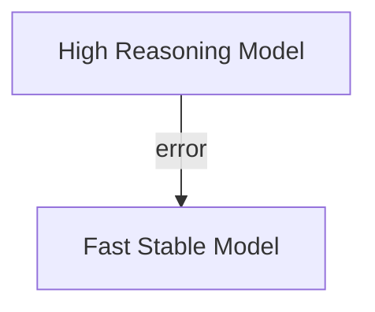

# HydraR: Complete Instruction Manual

## 1. Introduction

`HydraR` is a state-managed orchestration framework for building "agentic" workflows in R. Unlike simple chat interfaces, `HydraR` treats AI interactions as components of a larger, verifiable, and reproducible scientific pipeline. 

### Core Philosophy: The Visual Blueprint
We believe that complex AI logic should be **declarative** and **visual**. By defining your agent's reasoning as a Mermaid diagram, you create a "blueprint" that is:
- **Shareable**: Domain experts can audit the logic without reading R code.
- **Auditable**: Every execution path is recorded and can be visualized after the run.
- **Resilient**: Failures are handled through explicit error edges and model-tiering.

---

## 2. YAML Workflow Anatomy

HydraR workflows are typically defined in `.yml` files. These files provide the high-level orchestration, logic components, and initial state for the Agent Graph.

### Root Keys

| Key | Purpose |
| :--- | :--- |
| **`graph`** | A Mermaid string (e.g., `graph TD`) defining the network topology. This is the source of truth for node IDs and edges. |
| **`conditional_edges`** | Defines branching logic where the next node depends on the output of a previous node (e.g., Success/Failure loops). |
| **`roles`** | A dictionary of AI personas/system prompts referenced by `role_id`. |
| **`logic`** | A dictionary of R code blocks (logic functions) or prompt templates. |
| **`start_node`** | Explicit entry point for the graph (optional, defaults to root nodes). |
| **`initial_state`** | The seed data injected into the `AgentState` before execution begins. |

---

## 3. Node Technical Gallery

`HydraR` uses specialized R6 classes to handle different types of tasks.

### `type=llm` (AgentLLMNode)
The primary node for interacting with Large Language Models.
- **Role**: Combines a system prompt and user input into an LLM call.
- **Key Parameters**:
    - `driver`: The execution engine (e.g., `gemini_api`, `ollama`).
    - `role_id`: Lookup key in the `roles` section.

### `type=logic` (AgentLogicNode)
Executes deterministic R code.
- **Role**: Data validation, file I/O, template rendering, and decision gates.
- **Note**: Must adhere to **APAF Rule G-25** (no `for` loops).

### `type=router` (AgentRouterNode)
A decision-based node that dynamically selects the next node based on R logic.

### `type=map` (AgentMapNode)
Iterates over a list in the current state to process multiple items.

### `type=observer` (AgentObserverNode)
Executes logic for side-effects without modifying the main state.

### `type=merge` (MergeHarmonizer)
Synchronizes parallel execution paths, reconciling changes from isolated git worktrees back into the base state.

---

## 4. Resilience & Execution Control

AI agents are inherently non-deterministic. `HydraR` provides robust tools to manage this uncertainty.

### 4.1 Retries & Timeouts
Every node supports a `retries` parameter (default is 0) and a `timeout` (in seconds). If an LLM call fails, `HydraR` will automatically retry before triggering a failover.

### 4.2 Error Edges (Red/Dashed)
Standard edges (`-->`) represent the success path. **Error Edges** are prioritized failover paths triggered only when a node returns a `failed` or `error` status.



### 4.3 Human-in-the-Loop (HITL)
By routing an error edge to a node that returns `status="pause"`, the entire DAG will halt, allowing a human to inspect the `AgentState` and manually correct it before resuming.

---

## 5. Isolation with Git Worktrees

For bioinformatics pipelines that modify files, `HydraR` offers high-fidelity isolation through **Git Worktrees**.

When `isolation=true` is set on a node:
1. `HydraR` creates a temporary, isolated workspace (sandbox).
2. The agent works within that workspace, preventing accidental overwriting of main project files.
3. Upon completion, a `MergeHarmonizer` node reconciles the changes back to the main branch.

---

## 6. Validation & Compliance

`HydraR` enforces a "Safety-First" policy through its integrated Validation Engine.

### 6.1 Holistic Validation
Every time you call `spawn_dag()`, the engine checks resource linking, topology synchronization, and syntactic correctness.

### 6.2 APAF Rule G-25
To ensure performance and reproducibility, `HydraR` enforces a **Zero-Tolerance Policy for Imperative Loops**.
- **Rule**: Never use `for` loops in logic blocks.
- **Standard**: Always use `purrr::map()` or `lapply()`.

---

## 7. Model Context Protocol (MCP)

`HydraR` supports the **Model Context Protocol (MCP)** via a pass-through architecture. This allows agents to leverage external tools (databases, APIs, local files) using native MCP clients built into CLI drivers.

### 7.1 Pass-Through Architecture
`HydraR` does not act as an MCP Client itself; instead, it orchestrates agents that manage their own MCP configurations. This keeps the R-based state management clean and decoupled from the specific tool-use implementations of the LLM provider.

### 7.2 Configuration via `cli_opts`
You can enable and configure MCP servers by passing provider-specific flags in the `cli_opts` of an `AgentLLMNode`.

| Provider | Flag | Purpose |
| :--- | :--- | :--- |
| **Claude** | `mcp_config` | Path to a valid `claude_desktop_config.json`. |
| **Gemini** | `allowed_mcp_server_names` | A list of permitted MCP server identifiers. |

#### Example: Configuring an MCP SQL Server

```yaml
graph: |
  graph TD
    DBAgent["Query Node | type=llm | driver=anthropic | role_id=sql_analyst"]
logic:
  DBAgent:
    cli_opts:
      mcp_config: "/etc/hydrar/mcp/sql_config.json"
      permission_mode: "bypassPermissions"
```

---

## 8. Summary & Next Steps

For practical examples, please refer to:
- **[Sydney to Hong Kong Travel Planner](hong_kong_travel.md)**
- **[Parallel Sorting Benchmark](sorting_benchmark.md)**
- **[State Persistence](state_persistence.md)**

---

<!-- APAF Bioinformatics | HydraR_Manual | Approved | 2026-04-07 -->
