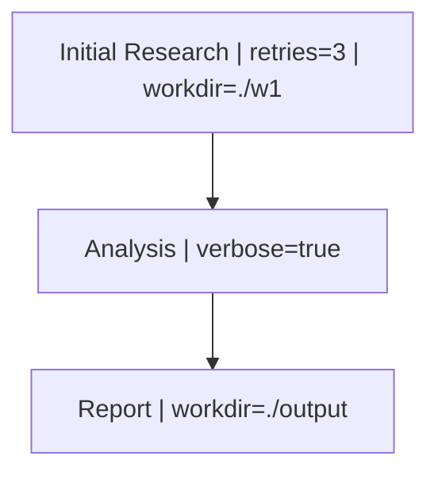

```{r, include = FALSE}
knitr::opts_chunk$set(
  collapse = TRUE,
  comment = "#>",
  eval = TRUE
)
```

This vignette demonstrates how to use the `HydraR` Mermaid interpreter to inject parameters directly into nodes using pipe-delimited labels.

## Parameter Syntax

In your Mermaid specification, you can include parameters within a node's label:



## Setup

## Defining the Workflow Components

To keep our architecture clean, we store the logic for our custom nodes in a central registry.

```{r logic_registry}
param_logic_registry <- list(
  # 1. Custom Node Logic
  logic = list(
    Default = function(state, params = list()) {
      # This function will be called by our CustomNode class
      param_str <- if (length(params) > 0) {
        paste(names(params), params, sep = "=", collapse = ", ")
      } else {
        "none"
      }
      message(sprintf("   [%s] Executing logic... (Params: %s)", state$node_id, param_str))
      list(status = "SUCCESS", output = paste("Result from", state$node_id))
    }
  )
)
```

## The Node Factory

We use a factory function to dynamically resolve nodes and inject parameters parsed from the Mermaid graph.

```{r factory}
# 1. Define a Specialized Node Factory
param_node_factory <- function(id, label, params = list()) {
  # Create a custom node class for this example
  CustomNode <- R6::R6Class("CustomNode",
    inherit = AgentNode,
    public = list(
      run = function(state) {
        # Delegate to our registry logic
        param_logic_registry$logic$Default(state, self$params)
      }
    )
  )

  CustomNode$new(id, label, params)
}
```

## Instantiating and Running the DAG

```{r run}
# Define the spec
mermaid_spec <- "
graph TD
  A[\"Initial Research | retries=3 | workdir=./w1\"] --> B[\"Analysis | verbose=true\"]
  B --> C[\"Report | workdir=./output\"]
"

# Create DAG from Mermaid using the standard method
dag <- AgentDAG$from_mermaid(mermaid_spec, node_factory = param_node_factory)

# Verify Parameter Injection
print(dag$nodes$A$params)
print(dag$nodes$B$params)

# Run the DAG
dag$run(initial_state = list(input = "test data"))
```

## Round-Trip Visualization

You can also use the `plot(details = TRUE)` method to export your DAG back to Mermaid with the parameters preserved or filtered.

```{r plot}
# Show all parameters
cat(dag$plot(details = TRUE))

# Filter to specific parameters
cat(dag$plot(details = TRUE, include_params = "retries"))
```

<!-- APAF Bioinformatics | parameterized_mermaid.Rmd | Approved | 2026-03-29 -->
