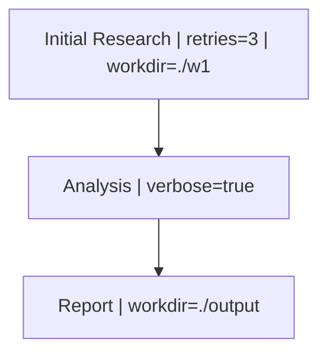

```{r, include = FALSE}
knitr::opts_chunk$set(
  collapse = TRUE,
  comment = "#>",
  eval = TRUE
)
```

This vignette demonstrates how to use the `HydraR` Mermaid interpreter to inject parameters directly into nodes using pipe-delimited labels.

## Parameter Syntax

In your Mermaid specification, you can include parameters within a node's label:



## Setup

First, we define a specialized `NodeFactory` that can handle these parameters and inject them into a custom node class.

```{r setup}
library(HydraR)

# 1. Define a Specialized Node Factory
node_factory <- function(id, label, params = list()) {
  
  # Create a custom node class for this example
  CustomNode <- R6::R6Class("CustomNode", 
    inherit = AgentNode,
    public = list(
      run = function(state) {
        param_str <- if(length(self$params) > 0) {
          paste(names(self$params), self$params, sep = "=", collapse = ", ")
        } else {
          "none"
        }
        message(sprintf("   [%s] Executing logic... (Params: %s)", self$id, param_str))
        list(status = "success", output = paste("Result from", self$id))
      }
    )
  )
  
  CustomNode$new(id, label, params)
}
```

## Instantiating and Running the DAG

```{r run}
# Define the spec
mermaid_spec <- "
graph TD
  A[\"Initial Research | retries=3 | workdir=./w1\"] --> B[\"Analysis | verbose=true\"]
  B --> C[\"Report | workdir=./output\"]
"

# Create DAG from Mermaid
dag <- mermaid_to_dag(mermaid_spec, node_factory)

# Verify Parameter Injection
print(dag$nodes$A$params)
print(dag$nodes$B$params)

# Run the DAG
dag$run(initial_state = list(input = "test data"))
```

## Round-Trip Visualization

You can also use the `plot(details = TRUE)` method to export your DAG back to Mermaid with the parameters preserved or filtered.

```{r plot}
# Show all parameters
cat(dag$plot(details = TRUE))

# Filter to specific parameters
cat(dag$plot(details = TRUE, include_params = "retries"))
```

<!-- APAF Bioinformatics | parameterized_mermaid.Rmd | Approved | 2026-03-29 -->
