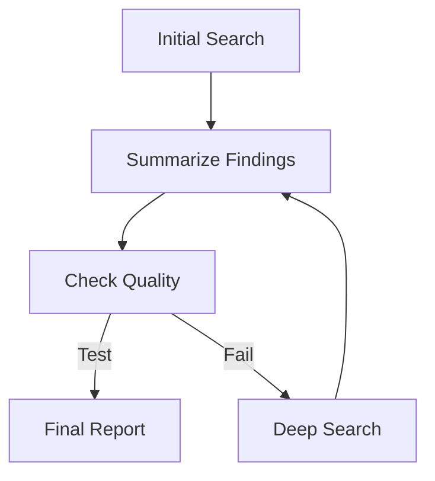

```{r, include = FALSE}
knitr::opts_chunk$set(
  collapse = TRUE,
  comment = "#>",
  eval = TRUE
)
```

This vignette demonstrates how to define an `AgentDAG` using Mermaid syntax and later generate a status-colored visualization after a run.

## Workflow Spec

We start with a workflow that includes a conditional logic point.



## Setup

## Defining the Workflow Components

To keep our architecture clean, we store all deterministic logic functions in a central registry.

```{r logic_registry}
round_trip_logic_registry <- list(
  # 1. Deterministic Logic Functions
  logic = list(
    Check = function(state, params = NULL) {
      # A logic node that fails the first time but succeeds the second
      run_count <- state$get("check_runs") %||% 0
      state$set("check_runs", run_count + 1)

      if (run_count == 0) {
        cat("Quality check failed. Routing to ReSearch...\n")
        return(list(status = "SUCCESS", output = FALSE))
      } else {
        cat("Quality check passed!\n")
        return(list(status = "SUCCESS", output = TRUE))
      }
    },
    Default = function(state, params = NULL) {
      list(status = "SUCCESS", output = paste("Result from", state$node_id))
    }
  )
)
```

## The Node Factory

We use a factory function to dynamically resolve nodes. If a specialized logic function isn't found, we fall back to a default processing node.

```{r factory}
round_trip_node_factory <- function(id, label, params) {
  logic_fn <- round_trip_logic_registry$logic[[id]] %||% round_trip_logic_registry$logic$Default

  AgentLogicNode$new(
    id = id,
    label = label,
    logic_fn = logic_fn
  )
}
```

## Creating and Running the DAG

Next, we create the DAG from our Mermaid string and run it with a `max_steps` limit.

```{r dag}
mermaid_spec <- "
graph TD
  Start[Initial Search] --> Summarize[Summarize Findings]
  Summarize --> Check[Check Quality]
  Check --> Publish[Final Report]
  Check --> ReSearch[Deep Search]
  ReSearch --> Summarize
"

# Create DAG from Mermaid
dag <- AgentDAG$from_mermaid(mermaid_spec, node_factory = round_trip_node_factory)

# Add the conditional logic for the quality loop
dag$add_conditional_edge(
  from = "Check",
  test = function(out) out == TRUE,
  if_true = "Publish",
  if_false = "ReSearch"
)

# Run the DAG
results <- dag$run(initial_state = list(check_runs = 0), max_steps = 10)
```

## Round-Trip Visualization

After a run, you can generate a **status-colored** Mermaid string using the `plot(status = TRUE)` method.

```{r plot}
# Export status-colored Mermaid
mermaid_colored <- dag$plot(status = TRUE)

# Show the colored Mermaid syntax
cat(mermaid_colored)
```

> [!NOTE]
> The `plot(status = TRUE)` method uses the internal trace log to color nodes by their outcome: **Green** for success, **Red** for failure, and **Blue** for active paths.

<!-- APAF Bioinformatics | round_trip_demo.Rmd | Approved | 2026-03-29 -->
