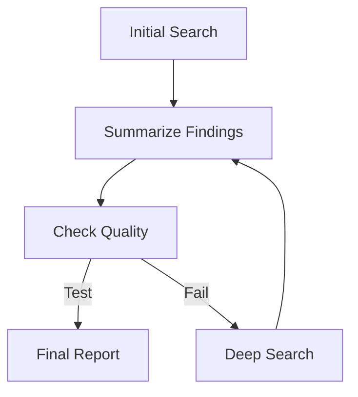

```{r, include = FALSE}
knitr::opts_chunk$set(
  collapse = TRUE,
  comment = "#>",
  eval = TRUE
)
```

This vignette demonstrates how to define an `AgentDAG` using Mermaid syntax and later generate a status-colored visualization after a run.

## Workflow Spec

We start with a workflow that includes a conditional logic point.



## Setup

First, we define a specialized `NodeFactory` that can handle these components and map them to logical objects.

```{r setup, message = FALSE}
library(HydraR)

# 1. Define a Specialized Node Factory
node_factory <- function(id, label) {
  if (id == "Check") {
    # A logic node that fails the first time but succeeds the second
    return(AgentLogicNode$new(id, function(state) {
      run_count <- state$get("check_runs") %||% 0
      state$set("check_runs", run_count + 1)

      if (run_count == 0) {
        cat("Quality check failed. Routing to ReSearch...\n")
        return(list(status = "success", output = FALSE))
      } else {
        cat("Quality check passed!\n")
        return(list(status = "success", output = TRUE))
      }
    }, label = label))
  }

  # Default node type
  return(AgentLogicNode$new(id, function(state) {
    list(status = "success", output = paste("Result from", label))
  }, label = label))
}
```

## Creating and Running the DAG

Next, we create the DAG from our Mermaid string and run it with a `max_steps` limit.

```{r dag}
mermaid_spec <- "
graph TD
  Start[Initial Search] --> Summarize[Summarize Findings]
  Summarize --> Check[Check Quality]
  Check --> Publish[Final Report]
  Check --> ReSearch[Deep Search]
  ReSearch --> Summarize
"

# Create DAG from Mermaid
dag <- mermaid_to_dag(mermaid_spec, node_factory)

# 4. Map the conditional logic
dag$add_conditional_edge("Check", test = function(out) out == TRUE, if_true = "Publish", if_false = "ReSearch")

# 5. Run the DAG
results <- dag$run(initial_state = list(check_runs = 0), max_steps = 10)
```

## Round-Trip Visualization

After a run, you can generate a **status-colored** Mermaid string using the `plot(status = TRUE)` method.

```{r plot}
# Export status-colored Mermaid
mermaid_colored <- dag$plot(status = TRUE)

# Show the colored Mermaid syntax
cat(mermaid_colored)
```

> [!NOTE]
> The `plot(status = TRUE)` method uses the internal trace log to color nodes by their outcome: **Green** for success, **Red** for failure, and **Blue** for active paths.

<!-- APAF Bioinformatics | round_trip_demo.Rmd | Approved | 2026-03-29 -->
