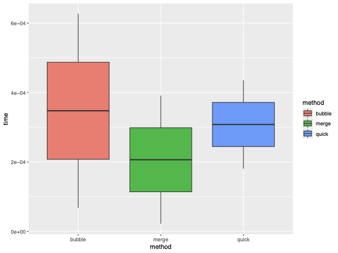
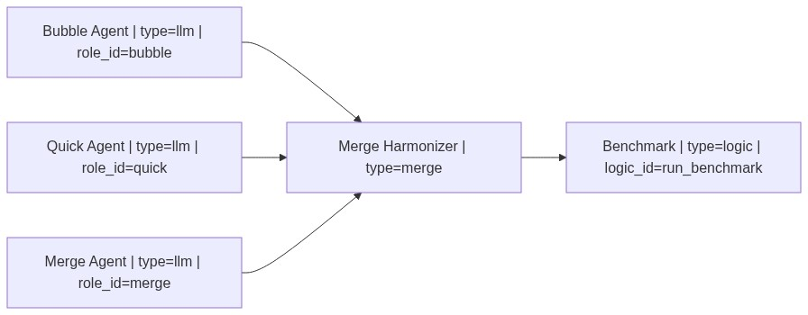

# Case Study: Parallel Sorting Algorithm Comparison

This case study demonstrates the use of **Git Worktrees** for isolated, parallel agent execution in `HydraR`.

## Overview

This benchmarking example tasks three distinct LLM agents with simultaneously implementing different sorting algorithms (Bubble Sort, Quick Sort, and Merge Sort). To prevent filesystem side-effects and race conditions, `HydraR` executes each task within an **isolated Git worktree**.

Following execution, a **Merge Harmonizer** node systematically reconciles the independent branches back to the main state. A terminal logic node then empirically benchmarks the aggregated algorithms across multiple continuous trials.

## Results


*Figure 1: Sorting Algorithm Performance Benchmark (1,000 elements over 5 trials). Note: This plot is generated dynamically during the workflow.*

## Workflow Structure

The workflow features a **fan-out/fan-in** pattern. Multiple agents work in parallel branches, and their work is integrated by a specialized `MergeHarmonizer` node before benchmarking.


*Figure 2: Visual representation of the parallel sorting comparison workflow, showing the fan-out/fan-in pattern.*

### Declarative Workflow (YAML)

```yaml
graph: |
  graph LR
      bubble["Bubble Agent | type=llm | role_id=bubble"]
      quick["Quick Agent | type=llm | role_id=quick"]
      merge["Merge Agent | type=llm | role_id=merge"]
      merger["Merge Harmonizer | type=merge"]
      benchmark["Benchmark | type=logic | logic_id=run_benchmark"]

      bubble --> merger
      quick --> merger
      merge --> merger
      merger --> benchmark
```

### R Orchestration (Parallel with Isolation)

Setting `use_worktrees = TRUE` enables the isolated execution environment for each parallel branch:

```r
library(HydraR)
wf <- load_workflow("sorting_benchmark.yml")
dag <- spawn_dag(wf, auto_node_factory())

# Execute with parallel worktrees
results <- dag$run(
  initial_state = wf$initial_state, 
  use_worktrees = TRUE
)
```

---

## Technical Source
The full implementation details, including the benchmarking logic and parallel execution setup, can be found in the source vignette:

- **Source Vignette**: [sorting_benchmark.Rmd](sorting_benchmark.Rmd)

<!-- APAF Bioinformatics | HydraR | Approved -->
